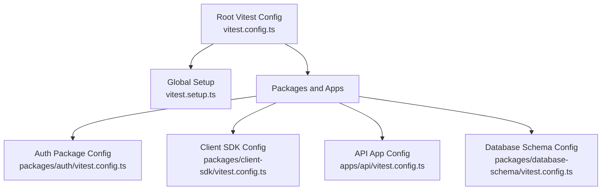
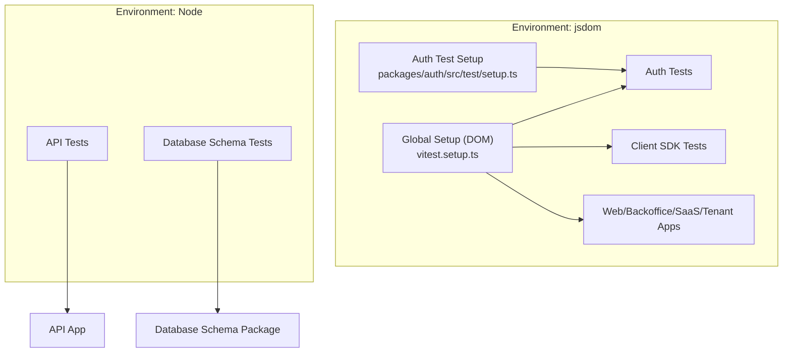
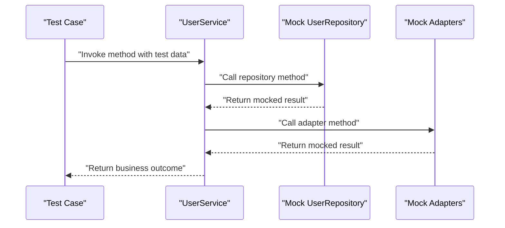
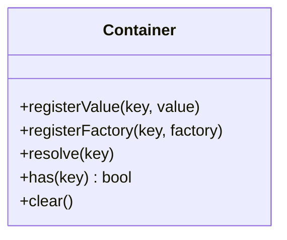
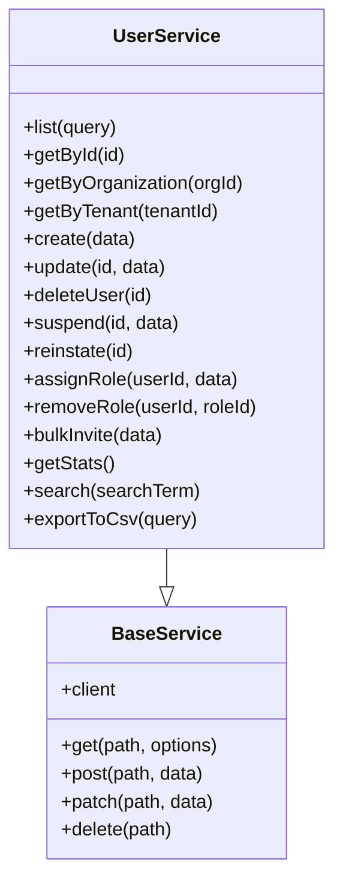
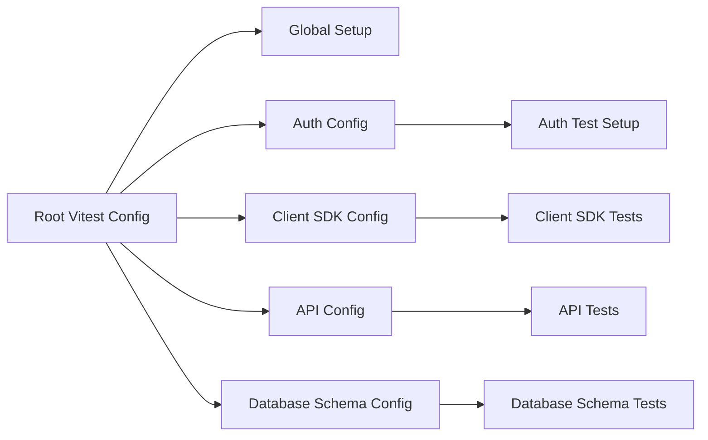

# Unit Testing

<cite>
**Referenced Files in This Document**
- [vitest.config.ts](file://vitest.config.ts)
- [vitest.setup.ts](file://vitest.setup.ts)
- [apps/api/vitest.config.ts](file://apps/api/vitest.config.ts)
- [packages/auth/vitest.config.ts](file://packages/auth/vitest.config.ts)
- [packages/client-sdk/vitest.config.ts](file://packages/client-sdk/vitest.config.ts)
- [packages/database-schema/vitest.config.ts](file://packages/database-schema/vitest.config.ts)
- [apps/api/tests/unit/services/user.service.test.ts](file://apps/api/tests/unit/services/user.service.test.ts)
- [apps/api/tests/unit/repositories/user.repository.test.ts](file://apps/api/tests/unit/repositories/user.repository.test.ts)
- [apps/api/tests/unit/core/container.test.ts](file://apps/api/tests/unit/core/container.test.ts)
- [packages/auth/src/test/setup.ts](file://packages/auth/src/test/setup.ts)
- [packages/client-sdk/src/services/user.service.ts](file://packages/client-sdk/src/services/user.service.ts)
</cite>

## Table of Contents
1. [Introduction](#introduction)
2. [Project Structure](#project-structure)
3. [Core Components](#core-components)
4. [Architecture Overview](#architecture-overview)
5. [Detailed Component Analysis](#detailed-component-analysis)
6. [Dependency Analysis](#dependency-analysis)
7. [Performance Considerations](#performance-considerations)
8. [Troubleshooting Guide](#troubleshooting-guide)
9. [Conclusion](#conclusion)

## Introduction
This document explains the Vitest-based unit testing architecture used across the monorepo. It covers test organization patterns, mocking strategies, and best practices for writing effective unit tests for services, repositories, controllers, and utility functions. It also documents setup procedures, isolation techniques, and testing approaches for shared packages such as authentication, database schema, and the client SDK.

## Project Structure
The monorepo uses a hybrid approach:
- Root-level Vitest configuration orchestrates tests across packages and apps, with a shared setup file for DOM environments and global mocks.
- Per-package configurations tailor environments (Node vs jsdom), coverage, and include/exclude patterns.
- Application-specific configurations further specialize environments and aliases.

Key characteristics:
- Root Vitest configuration enables jsdom environment, shared setup, and includes tests across packages and apps.
- Package-level configurations specify environment and coverage policies tailored to their needs.
- Application-level configurations align with app-specific environments and aliases.

**Diagram sources**
- [vitest.config.ts](file://vitest.config.ts#L1-L57)
- [vitest.setup.ts](file://vitest.setup.ts#L1-L70)
- [packages/auth/vitest.config.ts](file://packages/auth/vitest.config.ts#L1-L22)
- [packages/client-sdk/vitest.config.ts](file://packages/client-sdk/vitest.config.ts#L1-L16)
- [apps/api/vitest.config.ts](file://apps/api/vitest.config.ts#L1-L23)
- [packages/database-schema/vitest.config.ts](file://packages/database-schema/vitest.config.ts#L1-L20)

**Section sources**
- [vitest.config.ts](file://vitest.config.ts#L1-L57)
- [vitest.setup.ts](file://vitest.setup.ts#L1-L70)
- [packages/auth/vitest.config.ts](file://packages/auth/vitest.config.ts#L1-L22)
- [packages/client-sdk/vitest.config.ts](file://packages/client-sdk/vitest.config.ts#L1-L16)
- [apps/api/vitest.config.ts](file://apps/api/vitest.config.ts#L1-L23)
- [packages/database-schema/vitest.config.ts](file://packages/database-schema/vitest.config.ts#L1-L20)

## Core Components
- Root Vitest configuration:
  - Enables jsdom environment for UI-focused tests and Node for backend tests.
  - Includes tests across packages and apps via glob patterns.
  - Provides coverage reporting and excludes build artifacts and test files from coverage.
  - Resolves module aliases for design system, i18n, auth, and client SDK packages.
- Global setup:
  - Cleans up DOM after each test.
  - Provides mocks for browser APIs commonly used in UI components (matchMedia, IntersectionObserver, ResizeObserver, document.getAnimations, HTMLDialogElement).
- Package-specific configurations:
  - Auth package sets up jsdom and a dedicated test setup file for window.history and window.location.
  - Client SDK package targets jsdom and focuses coverage on TypeScript sources.
  - API app uses Node environment and includes a strict alias for @.
  - Database schema package uses Node environment and targets tests under a dedicated folder.

**Section sources**
- [vitest.config.ts](file://vitest.config.ts#L18-L56)
- [vitest.setup.ts](file://vitest.setup.ts#L1-L70)
- [packages/auth/vitest.config.ts](file://packages/auth/vitest.config.ts#L4-L21)
- [packages/auth/src/test/setup.ts](file://packages/auth/src/test/setup.ts#L1-L25)
- [packages/client-sdk/vitest.config.ts](file://packages/client-sdk/vitest.config.ts#L1-L16)
- [apps/api/vitest.config.ts](file://apps/api/vitest.config.ts#L4-L22)
- [packages/database-schema/vitest.config.ts](file://packages/database-schema/vitest.config.ts#L1-L20)

## Architecture Overview
The testing architecture separates concerns by environment and package:
- UI and component tests run in jsdom with global mocks to emulate browser APIs.
- Backend and service-layer tests run in Node with minimal DOM mocks.
- Shared setup ensures consistent behavior across tests.

**Diagram sources**
- [vitest.setup.ts](file://vitest.setup.ts#L1-L70)
- [packages/auth/src/test/setup.ts](file://packages/auth/src/test/setup.ts#L1-L25)
- [vitest.config.ts](file://vitest.config.ts#L18-L56)
- [apps/api/vitest.config.ts](file://apps/api/vitest.config.ts#L4-L22)
- [packages/database-schema/vitest.config.ts](file://packages/database-schema/vitest.config.ts#L1-L20)

## Detailed Component Analysis

### Unit Test Organization Patterns
- Test files are grouped by responsibility:
  - Services: Business logic tests that mock repositories and adapters.
  - Repositories: Data access tests that mock database clients.
  - Core: Infrastructure components like dependency injection containers.
- Naming convention:
  - Test files use .test.ts suffix and reside under tests/unit within respective packages/apps.
- Shared setup:
  - A shared setup hook initializes common mocks and fixtures for API tests.

Examples of test organization:
- Service tests: [apps/api/tests/unit/services/user.service.test.ts](file://apps/api/tests/unit/services/user.service.test.ts#L1-L136)
- Repository tests: [apps/api/tests/unit/repositories/user.repository.test.ts](file://apps/api/tests/unit/repositories/user.repository.test.ts#L1-L131)
- Core tests: [apps/api/tests/unit/core/container.test.ts](file://apps/api/tests/unit/core/container.test.ts#L1-L91)

**Section sources**
- [apps/api/tests/unit/services/user.service.test.ts](file://apps/api/tests/unit/services/user.service.test.ts#L1-L136)
- [apps/api/tests/unit/repositories/user.repository.test.ts](file://apps/api/tests/unit/repositories/user.repository.test.ts#L1-L131)
- [apps/api/tests/unit/core/container.test.ts](file://apps/api/tests/unit/core/container.test.ts#L1-L91)

### Mocking Strategies
- Service-layer tests mock repositories and adapters to isolate business logic.
- Repository-layer tests mock database clients to validate queries and transformations.
- Global mocks for browser APIs ensure UI components can be tested without a real DOM.
- Package-specific setups mock window.history and window.location for routing-related tests.

**Diagram sources**
- [apps/api/tests/unit/services/user.service.test.ts](file://apps/api/tests/unit/services/user.service.test.ts#L16-L29)

**Section sources**
- [apps/api/tests/unit/services/user.service.test.ts](file://apps/api/tests/unit/services/user.service.test.ts#L1-L136)
- [apps/api/tests/unit/repositories/user.repository.test.ts](file://apps/api/tests/unit/repositories/user.repository.test.ts#L1-L131)
- [vitest.setup.ts](file://vitest.setup.ts#L10-L39)
- [packages/auth/src/test/setup.ts](file://packages/auth/src/test/setup.ts#L8-L24)

### Testing Asynchronous Operations
- Async tests use async/await and assert resolved values or thrown errors.
- Repository tests demonstrate returning promises and asserting chained operations (insert, returning, offset).
- Service tests validate side effects (e.g., sending emails) through adapter mocks.

Example references:
- Service async assertions: [apps/api/tests/unit/services/user.service.test.ts](file://apps/api/tests/unit/services/user.service.test.ts#L32-L55)
- Repository async assertions: [apps/api/tests/unit/repositories/user.repository.test.ts](file://apps/api/tests/unit/repositories/user.repository.test.ts#L94-L108)

**Section sources**
- [apps/api/tests/unit/services/user.service.test.ts](file://apps/api/tests/unit/services/user.service.test.ts#L32-L55)
- [apps/api/tests/unit/repositories/user.repository.test.ts](file://apps/api/tests/unit/repositories/user.repository.test.ts#L94-L108)

### Dependency Injection Patterns
- The DI container registers values and factories, caches factory results, and resolves dependencies.
- Tests verify overwriting behavior, caching semantics, and resolution errors.

**Diagram sources**
- [apps/api/tests/unit/core/container.test.ts](file://apps/api/tests/unit/core/container.test.ts#L8-L89)

**Section sources**
- [apps/api/tests/unit/core/container.test.ts](file://apps/api/tests/unit/core/container.test.ts#L1-L91)

### Service Layer Logic
- Client SDK services encapsulate HTTP operations and expose typed methods for admin user management.
- Tests validate method signatures and expected HTTP calls through mocking.

**Diagram sources**
- [packages/client-sdk/src/services/user.service.ts](file://packages/client-sdk/src/services/user.service.ts#L1-L150)

**Section sources**
- [packages/client-sdk/src/services/user.service.ts](file://packages/client-sdk/src/services/user.service.ts#L1-L150)

### Testing Controllers and Utilities
- Controller tests validate request handling, parameter parsing, and response generation.
- Utility tests focus on pure functions and helper logic with deterministic inputs and outputs.
- Authentication and authorization logic is covered by dedicated auth tests and RBAC tests.

References:
- Controller tests: [apps/api/src/__tests__/controllers/auth.controller.test.ts](file://apps/api/src/__tests__/controllers/auth.controller.test.ts)
- Auth utility tests: [apps/api/src/__tests__/auth/oauth-callback-returnto.test.ts](file://apps/api/src/__tests__/auth/oauth-callback-returnto.test.ts)
- RBAC tests: [apps/api/src/middleware/__tests__/rbac.test.ts](file://apps/api/src/middleware/__tests__/rbac.test.ts)

**Section sources**
- [apps/api/src/__tests__/controllers/auth.controller.test.ts](file://apps/api/src/__tests__/controllers/auth.controller.test.ts)
- [apps/api/src/__tests__/auth/oauth-callback-returnto.test.ts](file://apps/api/src/__tests__/auth/oauth-callback-returnto.test.ts)
- [apps/api/src/middleware/__tests__/rbac.test.ts](file://apps/api/src/middleware/__tests__/rbac.test.ts)

### Testing Shared Packages
- Authentication package:
  - Uses jsdom environment and a small setup to mock browser history and location.
- Database schema package:
  - Uses Node environment and targets tests under tests/.
- Client SDK package:
  - Uses jsdom environment and focuses coverage on TypeScript sources.

**Section sources**
- [packages/auth/vitest.config.ts](file://packages/auth/vitest.config.ts#L4-L21)
- [packages/auth/src/test/setup.ts](file://packages/auth/src/test/setup.ts#L1-L25)
- [packages/database-schema/vitest.config.ts](file://packages/database-schema/vitest.config.ts#L1-L20)
- [packages/client-sdk/vitest.config.ts](file://packages/client-sdk/vitest.config.ts#L1-L16)

## Dependency Analysis
- Root Vitest configuration depends on:
  - Global setup for DOM mocks and cleanup.
  - Environment selection (jsdom vs Node) per package/app.
- Package configurations depend on:
  - Their own setup files and coverage policies.
- Tests depend on:
  - Shared setup hooks and mocks.
  - Mocked dependencies (repositories, adapters, database clients).

**Diagram sources**
- [vitest.config.ts](file://vitest.config.ts#L1-L57)
- [vitest.setup.ts](file://vitest.setup.ts#L1-L70)
- [packages/auth/vitest.config.ts](file://packages/auth/vitest.config.ts#L1-L22)
- [packages/auth/src/test/setup.ts](file://packages/auth/src/test/setup.ts#L1-L25)
- [packages/client-sdk/vitest.config.ts](file://packages/client-sdk/vitest.config.ts#L1-L16)
- [apps/api/vitest.config.ts](file://apps/api/vitest.config.ts#L1-L23)
- [packages/database-schema/vitest.config.ts](file://packages/database-schema/vitest.config.ts#L1-L20)

**Section sources**
- [vitest.config.ts](file://vitest.config.ts#L1-L57)
- [vitest.setup.ts](file://vitest.setup.ts#L1-L70)
- [packages/auth/vitest.config.ts](file://packages/auth/vitest.config.ts#L1-L22)
- [packages/auth/src/test/setup.ts](file://packages/auth/src/test/setup.ts#L1-L25)
- [packages/client-sdk/vitest.config.ts](file://packages/client-sdk/vitest.config.ts#L1-L16)
- [apps/api/vitest.config.ts](file://apps/api/vitest.config.ts#L1-L23)
- [packages/database-schema/vitest.config.ts](file://packages/database-schema/vitest.config.ts#L1-L20)

## Performance Considerations
- Prefer mocking external dependencies to avoid slow network or database calls.
- Keep tests focused and fast; avoid unnecessary setup or teardown work.
- Use selective coverage inclusion to reduce report generation overhead.
- Leverage factory caching in DI tests to minimize repeated object creation.

## Troubleshooting Guide
Common issues and resolutions:
- Missing browser API mocks:
  - Symptom: Errors related to matchMedia, IntersectionObserver, ResizeObserver, or HTMLDialogElement.
  - Resolution: Ensure global setup is loaded and verify mocks are applied.
  - Reference: [vitest.setup.ts](file://vitest.setup.ts#L10-L39)
- History/location mocks in auth tests:
  - Symptom: Routing-related tests failing due to undefined history or location.
  - Resolution: Load auth test setup to mock window.history and window.location.
  - Reference: [packages/auth/src/test/setup.ts](file://packages/auth/src/test/setup.ts#L8-L24)
- Environment mismatch:
  - Symptom: Tests failing in jsdom or Node due to incorrect environment.
  - Resolution: Verify package-specific Vitest configuration and environment selection.
  - References:
    - [vitest.config.ts](file://vitest.config.ts#L18-L21)
    - [packages/auth/vitest.config.ts](file://packages/auth/vitest.config.ts#L6-L8)
    - [packages/client-sdk/vitest.config.ts](file://packages/client-sdk/vitest.config.ts#L4-L6)
    - [apps/api/vitest.config.ts](file://apps/api/vitest.config.ts#L5-L7)
    - [packages/database-schema/vitest.config.ts](file://packages/database-schema/vitest.config.ts#L4-L6)
- Coverage reporting anomalies:
  - Symptom: Unexpected coverage percentages or missing files.
  - Resolution: Adjust include/exclude patterns in package configs to reflect actual source and test locations.
  - References:
    - [vitest.config.ts](file://vitest.config.ts#L42-L54)
    - [packages/auth/vitest.config.ts](file://packages/auth/vitest.config.ts#L10-L19)
    - [packages/client-sdk/vitest.config.ts](file://packages/client-sdk/vitest.config.ts#L8-L13)
    - [apps/api/vitest.config.ts](file://apps/api/vitest.config.ts#L10-L15)
    - [packages/database-schema/vitest.config.ts](file://packages/database-schema/vitest.config.ts#L8-L17)

**Section sources**
- [vitest.setup.ts](file://vitest.setup.ts#L10-L39)
- [packages/auth/src/test/setup.ts](file://packages/auth/src/test/setup.ts#L8-L24)
- [vitest.config.ts](file://vitest.config.ts#L18-L21)
- [packages/auth/vitest.config.ts](file://packages/auth/vitest.config.ts#L6-L8)
- [packages/client-sdk/vitest.config.ts](file://packages/client-sdk/vitest.config.ts#L4-L6)
- [apps/api/vitest.config.ts](file://apps/api/vitest.config.ts#L5-L7)
- [packages/database-schema/vitest.config.ts](file://packages/database-schema/vitest.config.ts#L4-L6)
- [vitest.config.ts](file://vitest.config.ts#L42-L54)
- [packages/auth/vitest.config.ts](file://packages/auth/vitest.config.ts#L10-L19)
- [packages/client-sdk/vitest.config.ts](file://packages/client-sdk/vitest.config.ts#L8-L13)
- [apps/api/vitest.config.ts](file://apps/api/vitest.config.ts#L10-L15)
- [packages/database-schema/vitest.config.ts](file://packages/database-schema/vitest.config.ts#L8-L17)

## Conclusion
The monorepo’s Vitest-based testing framework provides a scalable, environment-aware setup for unit, integration, and cross-package tests. By leveraging shared global setup, targeted package configurations, and robust mocking strategies, teams can maintain fast, isolated, and reliable tests across services, repositories, controllers, and shared packages. Following the patterns and best practices outlined here ensures consistent coverage and maintainability across the entire codebase.