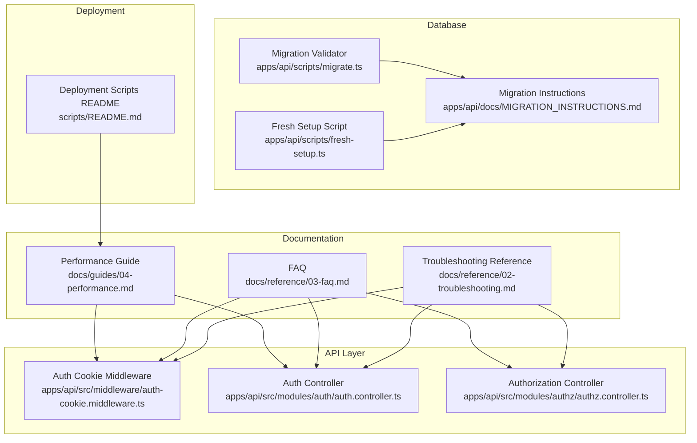
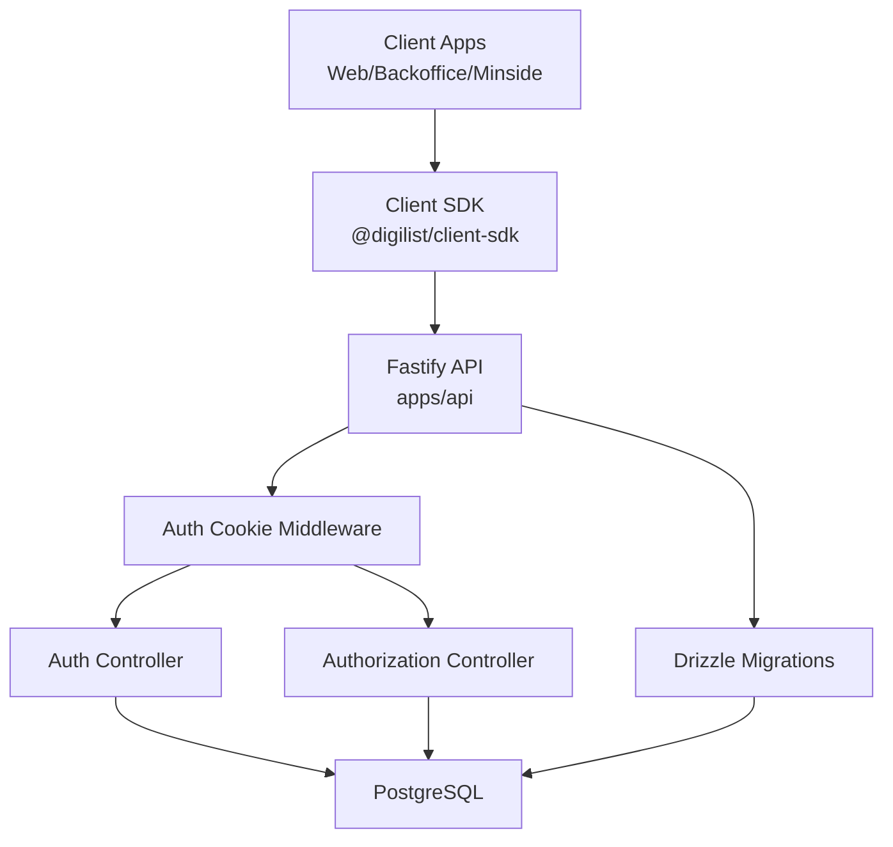
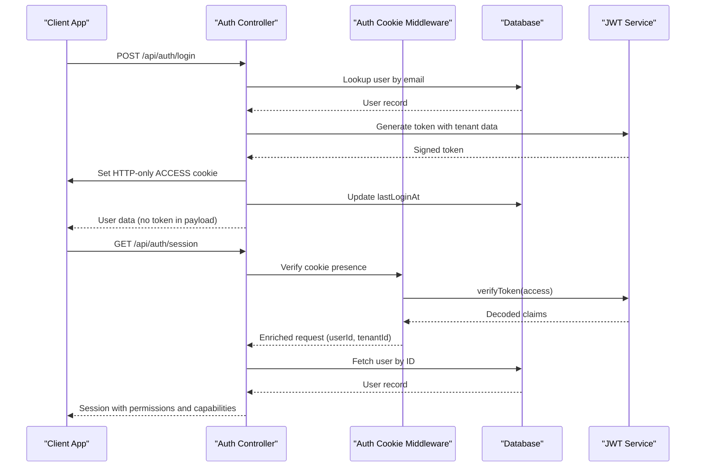
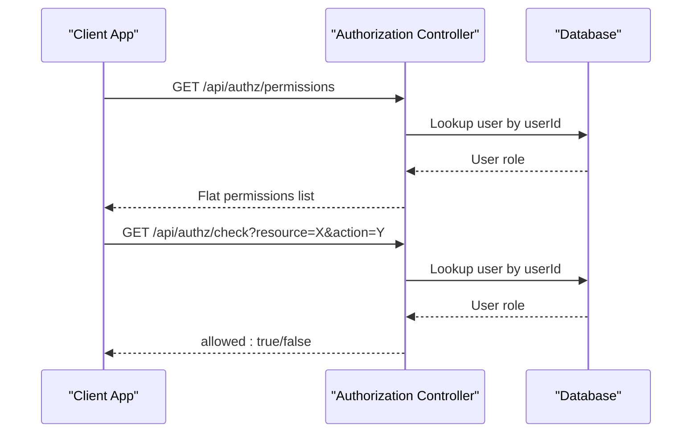
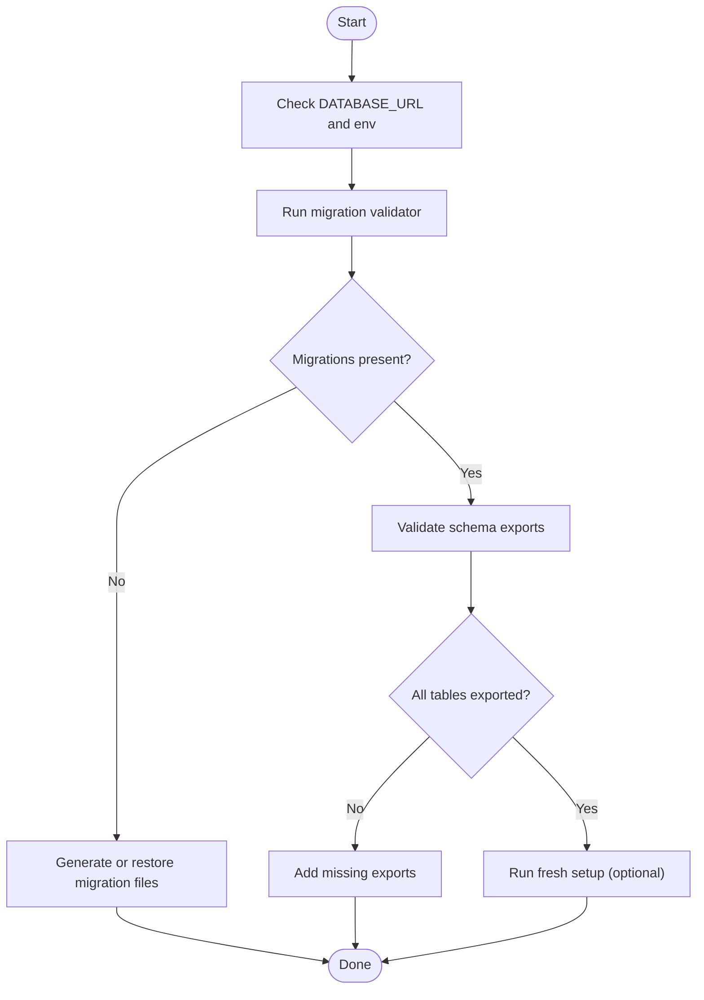
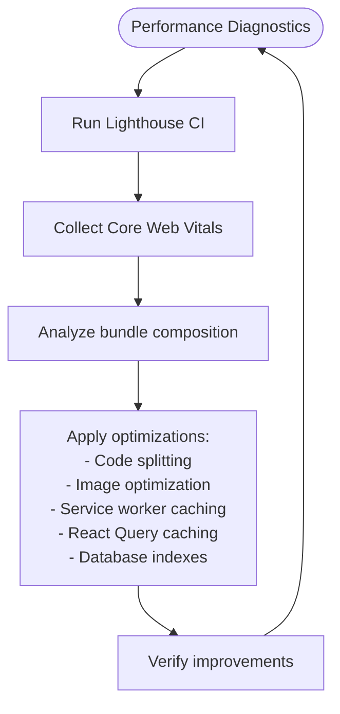
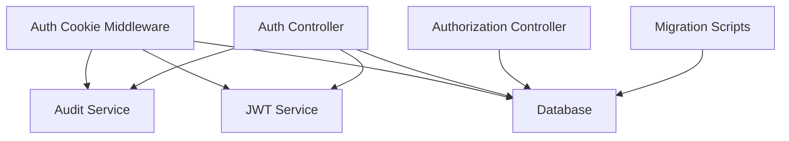
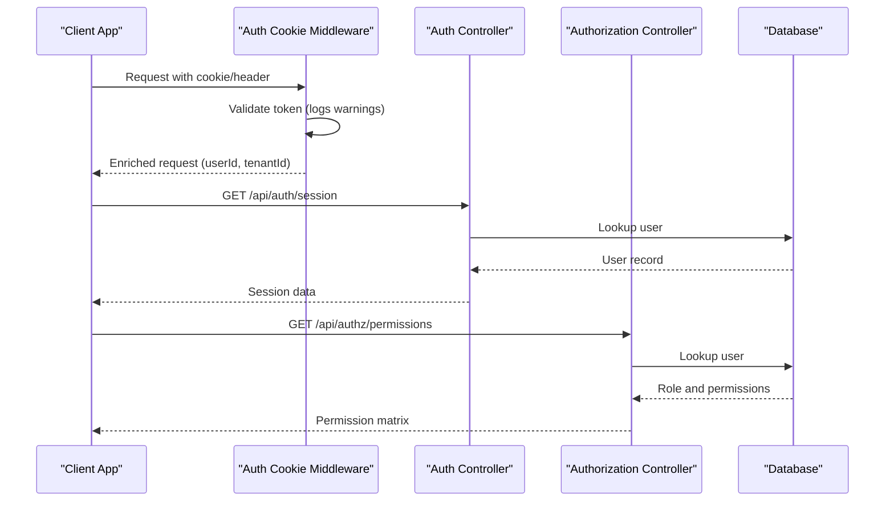

# Troubleshooting & FAQ

<cite>
**Referenced Files in This Document**
- [02-troubleshooting.md](file://docs/reference/02-troubleshooting.md)
- [03-faq.md](file://docs/reference/03-faq.md)
- [MIGRATION_INSTRUCTIONS.md](file://apps/api/docs/MIGRATION_INSTRUCTIONS.md)
- [04-performance.md](file://docs/guides/04-performance.md)
- [README.md](file://scripts/README.md)
- [auth-cookie.middleware.ts](file://apps/api/src/middleware/auth-cookie.middleware.ts)
- [auth.controller.ts](file://apps/api/src/modules/auth/auth.controller.ts)
- [authz.controller.ts](file://apps/api/src/modules/authz/authz.controller.ts)
- [migrate.ts](file://apps/api/scripts/migrate.ts)
- [fresh-setup.ts](file://apps/api/scripts/fresh-setup.ts)
</cite>

## Table of Contents
1. [Introduction](#introduction)
2. [Project Structure](#project-structure)
3. [Core Components](#core-components)
4. [Architecture Overview](#architecture-overview)
5. [Detailed Component Analysis](#detailed-component-analysis)
6. [Dependency Analysis](#dependency-analysis)
7. [Performance Considerations](#performance-considerations)
8. [Troubleshooting Guide](#troubleshooting-guide)
9. [Conclusion](#conclusion)
10. [Appendices](#appendices)

## Introduction
This document consolidates troubleshooting and frequently asked questions for the Xala/SaaS platform. It focuses on common setup problems, database migration issues, application startup failures, authentication and authorization debugging, real-time communication diagnostics, API integration pitfalls, performance tuning, memory optimization, scalability considerations, error handling patterns, logging strategies, diagnostic tools, migration and upgrade procedures, and step-by-step solutions for typical development and production issues.

## Project Structure
The troubleshooting and FAQ content spans several areas:
- Reference documents for development environment, build/deployment, SDK/API integration, testing, and component development
- API authentication and authorization controllers and middleware
- Database migration and setup scripts
- Performance guide with monitoring and measurement strategies
- Deployment scripts and server configuration guidance

**Diagram sources**
- [02-troubleshooting.md](file://docs/reference/02-troubleshooting.md#L1-L1072)
- [03-faq.md](file://docs/reference/03-faq.md#L1-L1386)
- [04-performance.md](file://docs/guides/04-performance.md#L1-L901)
- [auth-cookie.middleware.ts](file://apps/api/src/middleware/auth-cookie.middleware.ts#L1-L114)
- [auth.controller.ts](file://apps/api/src/modules/auth/auth.controller.ts#L1-L743)
- [authz.controller.ts](file://apps/api/src/modules/authz/authz.controller.ts#L1-L198)
- [migrate.ts](file://apps/api/scripts/migrate.ts#L1-L120)
- [fresh-setup.ts](file://apps/api/scripts/fresh-setup.ts#L1-L60)
- [MIGRATION_INSTRUCTIONS.md](file://apps/api/docs/MIGRATION_INSTRUCTIONS.md#L1-L170)
- [README.md](file://scripts/README.md#L1-L191)

**Section sources**
- [02-troubleshooting.md](file://docs/reference/02-troubleshooting.md#L1-L1072)
- [03-faq.md](file://docs/reference/03-faq.md#L1-L1386)
- [04-performance.md](file://docs/guides/04-performance.md#L1-L901)
- [auth-cookie.middleware.ts](file://apps/api/src/middleware/auth-cookie.middleware.ts#L1-L114)
- [auth.controller.ts](file://apps/api/src/modules/auth/auth.controller.ts#L1-L743)
- [authz.controller.ts](file://apps/api/src/modules/authz/authz.controller.ts#L1-L198)
- [migrate.ts](file://apps/api/scripts/migrate.ts#L1-L120)
- [fresh-setup.ts](file://apps/api/scripts/fresh-setup.ts#L1-L60)
- [MIGRATION_INSTRUCTIONS.md](file://apps/api/docs/MIGRATION_INSTRUCTIONS.md#L1-L170)
- [README.md](file://scripts/README.md#L1-L191)

## Core Components
- Authentication and session management with HTTP-only cookies, refresh token rotation, and CSRF protection
- Authorization via role-based access control (RBAC) with permission matrices
- Middleware that enriches requests with user context and logs authentication attempts
- Database migration and setup scripts with validation and troubleshooting steps
- Performance monitoring and optimization strategies for frontend and backend
- Deployment scripts with server path verification and troubleshooting guidance

**Section sources**
- [auth.controller.ts](file://apps/api/src/modules/auth/auth.controller.ts#L1-L743)
- [authz.controller.ts](file://apps/api/src/modules/authz/authz.controller.ts#L1-L198)
- [auth-cookie.middleware.ts](file://apps/api/src/middleware/auth-cookie.middleware.ts#L1-L114)
- [migrate.ts](file://apps/api/scripts/migrate.ts#L1-L120)
- [fresh-setup.ts](file://apps/api/scripts/fresh-setup.ts#L1-L60)
- [04-performance.md](file://docs/guides/04-performance.md#L1-L901)
- [README.md](file://scripts/README.md#L1-L191)

## Architecture Overview
The platform integrates frontend applications with a Fastify-based API secured by JWT tokens stored in HTTP-only cookies. Authentication middleware validates tokens and attaches user context to requests. Authorization is enforced via RBAC endpoints and matrices. Database migrations are managed through Drizzle with validation scripts. Performance monitoring and optimization are built-in across frontend, SDK, and backend layers.

**Diagram sources**
- [auth-cookie.middleware.ts](file://apps/api/src/middleware/auth-cookie.middleware.ts#L1-L114)
- [auth.controller.ts](file://apps/api/src/modules/auth/auth.controller.ts#L1-L743)
- [authz.controller.ts](file://apps/api/src/modules/authz/authz.controller.ts#L1-L198)
- [migrate.ts](file://apps/api/scripts/migrate.ts#L1-L120)

## Detailed Component Analysis

### Authentication Flow and Debugging
This sequence illustrates the login and session verification flow, highlighting where to check for issues such as cookie configuration, token validation, and audit logging.

**Diagram sources**
- [auth.controller.ts](file://apps/api/src/modules/auth/auth.controller.ts#L24-L102)
- [auth-cookie.middleware.ts](file://apps/api/src/middleware/auth-cookie.middleware.ts#L32-L103)

**Section sources**
- [auth.controller.ts](file://apps/api/src/modules/auth/auth.controller.ts#L24-L102)
- [auth-cookie.middleware.ts](file://apps/api/src/middleware/auth-cookie.middleware.ts#L32-L103)

### Authorization and RBAC
RBAC is enforced via permission matrices and endpoints that return permissions and capabilities for the authenticated user.

**Diagram sources**
- [authz.controller.ts](file://apps/api/src/modules/authz/authz.controller.ts#L17-L107)

**Section sources**
- [authz.controller.ts](file://apps/api/src/modules/authz/authz.controller.ts#L17-L107)

### Database Migration and Setup
Migration validation and setup scripts provide structured steps to diagnose and resolve migration-related issues.

**Diagram sources**
- [migrate.ts](file://apps/api/scripts/migrate.ts#L40-L90)
- [fresh-setup.ts](file://apps/api/scripts/fresh-setup.ts#L20-L55)

**Section sources**
- [migrate.ts](file://apps/api/scripts/migrate.ts#L40-L90)
- [fresh-setup.ts](file://apps/api/scripts/fresh-setup.ts#L20-L55)
- [MIGRATION_INSTRUCTIONS.md](file://apps/api/docs/MIGRATION_INSTRUCTIONS.md#L111-L140)

### Performance Monitoring and Optimization
Performance strategies include bundle size budgets, Core Web Vitals measurement, service worker caching, React Query caching, and database query optimization.

**Diagram sources**
- [04-performance.md](file://docs/guides/04-performance.md#L510-L625)

**Section sources**
- [04-performance.md](file://docs/guides/04-performance.md#L510-L625)

## Dependency Analysis
Authentication and authorization depend on JWT verification, database lookups, and audit logging. Middleware enriches requests with user context, while controllers manage sessions and permissions. Migration scripts depend on Drizzle configuration and database connectivity.

**Diagram sources**
- [auth-cookie.middleware.ts](file://apps/api/src/middleware/auth-cookie.middleware.ts#L1-L114)
- [auth.controller.ts](file://apps/api/src/modules/auth/auth.controller.ts#L1-L743)
- [authz.controller.ts](file://apps/api/src/modules/authz/authz.controller.ts#L1-L198)
- [migrate.ts](file://apps/api/scripts/migrate.ts#L1-L120)

**Section sources**
- [auth-cookie.middleware.ts](file://apps/api/src/middleware/auth-cookie.middleware.ts#L1-L114)
- [auth.controller.ts](file://apps/api/src/modules/auth/auth.controller.ts#L1-L743)
- [authz.controller.ts](file://apps/api/src/modules/authz/authz.controller.ts#L1-L198)
- [migrate.ts](file://apps/api/scripts/migrate.ts#L1-L120)

## Performance Considerations
- Bundle size budgets and Lighthouse scoring targets
- Code splitting, lazy loading, and skeleton screens
- Service worker caching strategies
- React Query caching and prefetching
- Database indexing and projection DTOs
- Real user monitoring (RUM) for production metrics

[No sources needed since this section provides general guidance]

## Troubleshooting Guide

### Development Environment
Common issues and fixes:
- pnpm install failures due to stale caches
- Blank page on dev server start (check browser console, circular dependencies, theme CSS)
- Missing SDK module errors (build SDK, verify Vite aliases, restart dev server)
- Theme CSS not loading in production (update theme paths, copy files to public, rebuild)

**Section sources**
- [02-troubleshooting.md](file://docs/reference/02-troubleshooting.md#L21-L111)
- [03-faq.md](file://docs/reference/03-faq.md#L64-L96)

### Build & Deployment
- Vite circular dependency in manualChunks (adjust chunk splitting)
- Duplicate vite.config files (.js vs .ts)
- Old version shown after successful deployment (browser cache, server cache-control)
- Production build crashes (environment variables, API URLs, hardcoded paths)

**Section sources**
- [02-troubleshooting.md](file://docs/reference/02-troubleshooting.md#L279-L406)
- [README.md](file://scripts/README.md#L69-L191)

### SDK & API Integration
- Direct API calls instead of SDK (architecture rule)
- SDK hook TypeError due to uninitialized SDK or missing tenant context
- React Query cache not invalidated after mutations
- WebSocket connection failures (URL scheme, server availability, firewall/proxy)

**Section sources**
- [02-troubleshooting.md](file://docs/reference/02-troubleshooting.md#L409-L530)
- [03-faq.md](file://docs/reference/03-faq.md#L496-L671)

### Authentication and Authorization
- Invalid/expired JWT token (middleware logs warnings, continues without auth)
- Session retrieval without middleware reliance (direct token verification)
- Logout revocation and cookie clearing
- Permission checks and capability flags

**Diagram sources**
- [auth-cookie.middleware.ts](file://apps/api/src/middleware/auth-cookie.middleware.ts#L32-L103)
- [auth.controller.ts](file://apps/api/src/modules/auth/auth.controller.ts#L244-L332)
- [authz.controller.ts](file://apps/api/src/modules/authz/authz.controller.ts#L17-L107)

**Section sources**
- [auth-cookie.middleware.ts](file://apps/api/src/middleware/auth-cookie.middleware.ts#L32-L103)
- [auth.controller.ts](file://apps/api/src/modules/auth/auth.controller.ts#L244-L332)
- [authz.controller.ts](file://apps/api/src/modules/authz/authz.controller.ts#L17-L107)

### Real-Time Communication
- WebSocket URL scheme mismatch (use wss:// in production, ws:// for local)
- Server health verification
- Firewall/proxy configuration for WebSocket traffic

**Section sources**
- [02-troubleshooting.md](file://docs/reference/02-troubleshooting.md#L499-L530)

### Database Migration Issues
- PostgreSQL connection refused (verify service, port, restart)
- Permission denied (correct credentials, grants)
- Database exists but missing tables (drop/recreate or run migrations)
- Migration files not found (ensure correct directory, regenerate if needed)
- Migration validation failures (check Drizzle migrations folder, schema exports)

**Section sources**
- [MIGRATION_INSTRUCTIONS.md](file://apps/api/docs/MIGRATION_INSTRUCTIONS.md#L111-L140)
- [migrate.ts](file://apps/api/scripts/migrate.ts#L40-L90)

### Upgrade and Compatibility
- Theme token regeneration after config changes
- SDK initialization before app rendering
- Environment variable alignment across environments
- Production build and preview testing before deployment

**Section sources**
- [03-faq.md](file://docs/reference/03-faq.md#L779-L800)
- [README.md](file://scripts/README.md#L122-L145)

### Error Handling Patterns and Logging
- Middleware logs invalid/expired tokens without throwing exceptions
- Controllers set Cache-Control headers to prevent caching sensitive responses
- Audit events recorded for login, logout, token refresh, and callbacks
- Graceful degradation when optional services fail (e.g., modules service)

**Section sources**
- [auth-cookie.middleware.ts](file://apps/api/src/middleware/auth-cookie.middleware.ts#L92-L102)
- [auth.controller.ts](file://apps/api/src/modules/auth/auth.controller.ts#L30-L102)
- [authz.controller.ts](file://apps/api/src/modules/authz/authz.controller.ts#L120-L193)

### Diagnostic Tools
- Browser DevTools performance profiling
- Lighthouse CI for automated performance testing
- Real user monitoring (RUM) for production metrics
- Bundle size monitoring and visualization
- Network throttling testing (3G conditions)

**Section sources**
- [04-performance.md](file://docs/guides/04-performance.md#L510-L625)

## Conclusion
This troubleshooting and FAQ guide consolidates actionable steps for resolving common issues across development, authentication, database migrations, real-time communication, API integration, performance, and deployment. By following the documented procedures and leveraging the provided diagnostic tools, teams can efficiently debug and maintain the Xala/SaaS platform in both development and production environments.

[No sources needed since this section summarizes without analyzing specific files]

## Appendices

### Step-by-Step: Fresh Database Setup
- Start PostgreSQL and verify readiness
- Create database and configure credentials
- Verify environment variables
- Apply migrations
- Verify tables and schema
- Troubleshoot connection, permissions, and missing files

**Section sources**
- [MIGRATION_INSTRUCTIONS.md](file://apps/api/docs/MIGRATION_INSTRUCTIONS.md#L11-L110)

### Step-by-Step: Production Deployment
- Configure deployment script with server details
- Run pre-flight checks (duplicate configs, theme files)
- Build apps with production environment
- Deploy to correct server directories
- Verify deployment accessibility
- Monitor error logs and server configuration

**Section sources**
- [README.md](file://scripts/README.md#L28-L191)