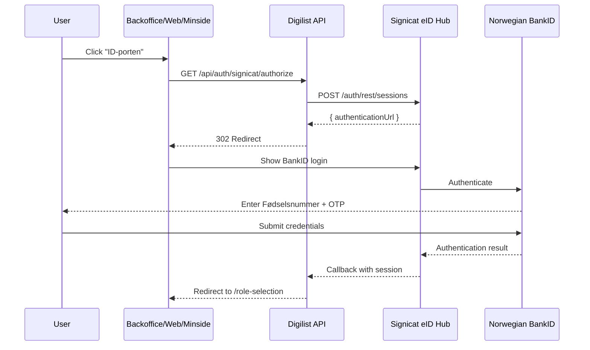

# Signicat BankID Integration Guide

## Overview

This guide documents the Signicat BankID integration for Digilist, enabling
Norwegian users to authenticate via BankID through the Signicat eID Hub.

---

## Architecture



---

## Test Credentials (Sandbox)

Use these test personnummer (national ID) numbers to test BankID login:

| Fødselsnummer | OTP   | Personal Code | Notes                     |
| ------------- | ----- | ------------- | ------------------------- |
| `22826406031` | `otp` | `qwer1234`    | Primary test user         |
| `21816895933` | `otp` | `qwer1234`    | Alternative user          |
| `27844796310` | `otp` | `qwer1234`    | Alternative user          |
| `01100844350` | `otp` | `qwer1234`    | API login_hint compatible |

### How to Login

1. Go to backoffice login: `https://backoffice-test.digilist.no/login`
2. Click **"ID-porten"** button
3. Enter **Fødselsnummer**: `22826406031`
4. Click **"Fortsett"** (Continue)
5. Enter **One Time Code**: `otp`
6. Enter **Personal Code**: `qwer1234`
7. Click confirm → Redirected to role selection

---

## Signicat Dashboard Configuration

### 1. Access Dashboard

- **Dashboard URL**: https://dashboard.signicat.com
- **API Base URL**: `https://api.signicat.com`

### 2. Domain Types

| Type     | URL Format                     | Use Case                    |
| -------- | ------------------------------ | --------------------------- |
| Standard | `YOUR_DOMAIN.app.signicat.com` | Quick setup, no DNS changes |
| Custom   | `login.YOUR_DOMAIN.com`        | Branded experience          |

### 3. Setting Up a Domain

1. Go to **Dashboard > Settings > Domain Management**
2. Click **+ Add domain**
3. Choose Standard or Custom tab
4. Enter domain name
5. Click **Add domain**

### 4. Adding Norwegian BankID

1. Go to **Products > eID Hub > eIDs**
2. Click **+ Add new**
3. Select **"Norwegian BankID"**
4. Configure settings and click **Add**

### 5. Ordering Test Users

1. In eIDs list, select **Test eIDs**
2. Choose **"Norwegian BankID login"**
3. Click **"Order test user"**
4. Select end-user type and gender
5. Click **"Generate number"**
6. Enter name and select **"Order"**

---

## API Credentials (Current)

```env
# Sandbox Credentials (hardcoded in signicat.controller.ts)
SIGNICAT_CLIENT_ID=sandbox-fantastic-house-812
SIGNICAT_CLIENT_SECRET=US1SxD0ett3Hczv00dOzdSxPyGjYK1PtbbDrXmMJLTVAkvlB
SIGNICAT_BASE_URL=https://api.signicat.com
SIGNICAT_CALLBACK_URL=https://api.digilist.no/api/auth/signicat/callback
```

---

## API Endpoints

| Endpoint                         | Method | Description                                  |
| -------------------------------- | ------ | -------------------------------------------- |
| `/api/auth/signicat/authorize`   | GET    | Initiates BankID flow, redirects to Signicat |
| `/api/auth/signicat/callback`    | GET    | Handles Signicat callback after auth         |
| `/api/auth/signicat/session/:id` | GET    | Poll session status                          |
| `/api/auth/signicat/config`      | GET    | Get public Signicat config                   |

### Query Parameters

**`/authorize`**:

- `returnTo` - URL to redirect after successful auth (default: `/`)
- `tenantId` - Tenant context for multi-tenant isolation

---

## Production Checklist

- [ ] Create production Signicat account
- [ ] Set up production domain (branded)
- [ ] Configure production callback URL
- [ ] Update environment variables on VPS
- [ ] Add SSL certificate for custom domain
- [ ] Order production BankID credentials
- [ ] Test full authentication flow
- [ ] Enable audit logging

---

## Troubleshooting

### Blank Page After Click

**Cause**: `session.url` was used instead of `session.authenticationUrl`

**Fix**: Line 218 & 247 in `signicat.controller.ts`:

```typescript
const session = await response.json() as {
    id: string;
    authenticationUrl: string;
};
return reply.redirect(session.authenticationUrl);
```

### 502 Bad Gateway

**Cause**: PM2 not loading `.env` file

**Fix**: Install dotenv and update ecosystem.config.cjs:

```javascript
require("dotenv").config();
module.exports = {
    apps: [{
        name: "digilist-api",
        env: { DATABASE_URL: process.env.DATABASE_URL },
    }],
};
```

### DATABASE_URL Missing

**Fix**: Copy from backup:

```bash
cp /var/www/digilist/api/.env /var/www/digilist-api/.env
pm2 restart digilist-api
```

---

## Related Files

| File                                                   | Purpose        |
| ------------------------------------------------------ | -------------- |
| `apps/api/src/modules/auth/signicat.controller.ts`     | API controller |
| `packages/client-sdk/src/services/signicat.service.ts` | SDK service    |
| `apps/backoffice/src/routes/login.tsx`                 | Login UI       |
