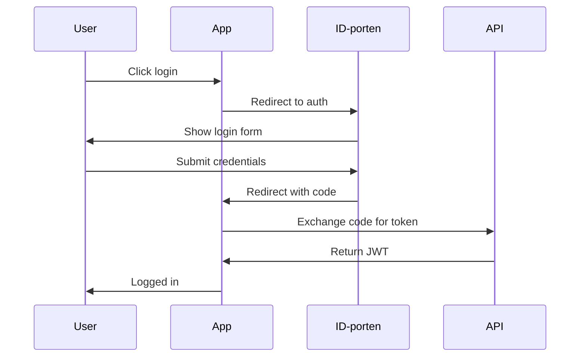

# Application Architecture

This document describes the architectural patterns and structures used in each application within the Xala Diglist Platform.

## Overview

Each application follows consistent architectural patterns while serving different user groups and use cases. All applications share:
- **Contract-first data fetching**
- **Design system compliance**
- **TypeScript throughout**
- **Feature-based organization**

## Frontend Architecture

### Common Structure
All frontend applications follow this structure:
```
apps/[app-name]/src/
├── app.tsx                    # App root with providers
├── main.tsx                  # Entry point
├── routes/                   # Route definitions (file-based)
│   ├── __root.tsx           # Root layout
│   ├── index.tsx            # Home page
│   ├── auth/                # Auth routes
│   └── features/            # Feature-specific routes
├── features/                # Feature modules
│   ├── [feature-name]/      # Feature directory
│   │   ├── components/      # UI components
│   │   ├── hooks/           # React hooks
│   │   ├── services/        # API services
│   │   ├── types/           # TypeScript types
│   │   └── index.ts         # Feature exports
├── shared/                  # Cross-feature code
│   ├── components/          # Shared components
│   ├── hooks/               # Shared hooks
│   ├── utils/               # Utilities
│   └── types/               # Shared types
└── styles/                  # Global styles
    └── globals.css          # Global CSS
```

### Provider Stack
All applications use the same provider stack:
```tsx
// app.tsx
export function App() {
  return (
    <DesignsystemetProvider theme="digdir" colorScheme="auto">
      <BrowserRouter>
        <QueryClientProvider client={queryClient}>
          <AuthProvider>
            <I18nProvider locale="nb">
              <ErrorBoundary>
                <Routes>
                  <Route path="/" component={Root} />
                </Routes>
              </ErrorBoundary>
            </I18nProvider>
          </AuthProvider>
        </QueryClientProvider>
      </BrowserRouter>
    </DesignsystemetProvider>
  );
}
```

### Routing Architecture
Using React Router v6 with file-based routing:
```tsx
// routes/__root.tsx
export function Route() {
  return (
    <div className="app">
      <Header />
      <main>
        <Outlet />
      </main>
      <Footer />
    </div>
  );
}

// routes/listings/index.tsx
export function Route() {
  const { data: listings } = useListings();
  return <ListingGrid listings={listings} />;
}
```

## Web Application Architecture

### Purpose & Audience
- **Purpose**: Public discovery and booking of listings
- **Audience**: General public, registered users
- **Key Features**: Search, browse, book listings

### Architecture Patterns
```tsx
// features/search/components/SearchResults.tsx
export function SearchResults() {
  const [filters, setFilters] = useSearchFilters();
  const { data: listings, isLoading } = usePublicListings(filters);
  
  return (
    <div>
      <SearchFilters filters={filters} onChange={setFilters} />
      {isLoading ? (
        <SearchSkeleton />
      ) : (
        <ListingGrid listings={listings} />
      )}
    </div>
  );
}
```

### State Management
- **Server State**: TanStack Query with caching
- **URL State**: Search filters in query params
- **Form State**: React Hook Form
- **UI State**: Local component state

### Performance Optimizations
- **Code splitting** at route level
- **Image optimization** with lazy loading
- **Virtual scrolling** for large lists
- **Prefetching** for likely navigation

## Backoffice Architecture

### Purpose & Audience
- **Purpose**: Administrative management of platform
- **Audience**: Organization administrators
- **Key Features**: Manage listings, bookings, users, reports

### Architecture Patterns
```tsx
// features/listings/components/ListingManager.tsx
export function ListingManager() {
  const { data: listings } = useOrganizationListings();
  const permissions = usePermissions();
  
  return (
    <DataTable
      data={listings}
      columns={createListingColumns(permissions)}
      actions={{
        create: permissions.canCreateListing,
        edit: permissions.canEditListing,
        delete: permissions.canDeleteListing,
      }}
    />
  );
}
```

### Permission-Based UI
```tsx
// shared/components/PermissionGuard.tsx
export function PermissionGuard({ 
  permission, 
  children, 
  fallback 
}: PermissionGuardProps) {
  const { hasPermission } = usePermissions();
  
  if (!hasPermission(permission)) {
    return fallback || null;
  }
  
  return <>{children}</>;
}
```

### Data Management
- **Complex forms** with validation
- **Bulk operations** on listings
- **File uploads** for images
- **Export functionality** for reports

## Min Side Architecture

### Purpose & Audience
- **Purpose**: Personal user dashboard
- **Audience**: Registered users
- **Key Features**: View bookings, manage profile

### Architecture Patterns
```tsx
// features/bookings/components/BookingList.tsx
export function BookingList() {
  const { data: bookings } = useMyBookings();
  const cancelBooking = useCancelBooking();
  
  return (
    <div>
      {bookings?.map(booking => (
        <BookingCard
          key={booking.id}
          booking={booking}
          onCancel={() => cancelBooking.mutate(booking.id)}
        />
      ))}
    </div>
  );
}
```

### Personalization
- **User preferences** stored locally
- **Recent activity** tracking
- **Personalized recommendations**
- **Notification management**

## API Architecture

### Backend Structure
```
apps/api/src/
├── main.ts                   # Server entry point
├── modules/                  # Domain modules
│   ├── auth/                 # Authentication
│   ├── listings/             # Listing management
│   ├── bookings/             # Booking system
│   ├── users/                # User management
│   └── organizations/        # Organization management
├── common/                   # Shared code
│   ├── decorators/           # Custom decorators
│   ├── interceptors/         # Request/response handling
│   ├── pipes/                # Data transformation
│   └── utils/                # Utilities
├── config/                   # Configuration
│   ├── database.ts           # DB config
│   ├── auth.ts               # Auth config
│   └── swagger.ts            # API docs
└── tests/                    # Test files
```

### Service Layer Pattern
```typescript
// modules/listings/listing.service.ts
@Injectable()
export class ListingService {
  constructor(
    private readonly repository: ListingRepository,
    private readonly permissionService: PermissionService,
  ) {}

  async findManyCards(filters: ListingFilters): Promise<ListingCardProjectionDTO[]> {
    const listings = await this.repository.findWithFilters(filters);
    
    return listings.map(listing => ({
      id: listing.id,
      title: listing.title,
      description: listing.description,
      imageUrl: listing.primaryImage,
      status: listing.status,
      permissions: this.permissionService.calculate(listing),
    }));
  }
}
```

### Controller Pattern
```typescript
// modules/listings/listing.controller.ts
@Controller('listings')
@ApiTags('listings')
export class ListingController {
  constructor(private readonly service: ListingService) {}

  @Get()
  @ApiOperation({ summary: 'Get listings' })
  public findMany(
    @Query() filters: ListingFiltersDTO,
  ): Promise<ListingCardProjectionDTO[]> {
    return this.service.findManyCards(filters);
  }

  @Get(':id')
  @Param('id', ParseUUIDPipe)
  public getById(
    @Param('id') id: string,
  ): Promise<ListingDetailsProjectionDTO> {
    return this.service.findDetailsById(id);
  }
}
```

## Cross-Application Patterns

### 1. Error Handling
```tsx
// shared/components/ErrorBoundary.tsx
export class ErrorBoundary extends Component<Props, State> {
  componentDidCatch(error: Error, errorInfo: ErrorInfo) {
    console.error('Error caught:', error, errorInfo);
    this.reportError(error, errorInfo);
  }

  render() {
    if (this.state.hasError) {
      return <ErrorFallback onReset={this.handleReset} />;
    }
    return this.props.children;
  }
}
```

### 2. Loading States
```tsx
// shared/components/LoadingStates.tsx
export function SuspenseWrapper({ children, fallback }: SuspenseWrapperProps) {
  return (
    <Suspense fallback={fallback || <PageSkeleton />}>
      {children}
    </Suspense>
  );
}

export function QueryWrapper({ 
  children, 
  query, 
  loadingFallback, 
  errorFallback 
}: QueryWrapperProps) {
  if (query.isLoading) return loadingFallback || <LoadingSpinner />;
  if (query.error) return errorFallback || <ErrorMessage error={query.error} />;
  return <>{children}</>;
}
```

### 3. Data Fetching
```tsx
// shared/hooks/useApiQuery.ts
export function useApiQuery<T>(
  key: QueryKey,
  fetcher: () => Promise<T>,
  options?: UseQueryOptions<T>
) {
  return useQuery({
    queryKey: key,
    queryFn: fetcher,
    staleTime: 5 * 60 * 1000, // 5 minutes
    cacheTime: 10 * 60 * 1000, // 10 minutes
    retry: 3,
    ...options,
  });
}
```

## Security Architecture

### Authentication Flow


### Authorization
```typescript
// shared/hooks/usePermissions.ts
export function usePermissions() {
  const { user } = useAuth();
  
  return {
    canCreateListing: user?.permissions.includes('listing:create'),
    canEditListing: (listingId: string) => 
      user?.permissions.includes('listing:edit') ||
      user?.ownedListings?.includes(listingId),
    canDeleteBooking: (bookingId: string) =>
      user?.permissions.includes('booking:delete') &&
      user?.bookings?.includes(bookingId),
  };
}
```

## Performance Architecture

### Frontend Optimizations
1. **Bundle Splitting**
   ```typescript
   // Route-based splitting
   const ListingDetails = lazy(() => import('./routes/listings/$id'));
   
   // Feature-based splitting
   const AdminPanel = lazy(() => import('./features/admin'));
   ```

2. **Data Caching**
   ```typescript
   // Query configuration
   useQuery({
     queryKey: ['listings', filters],
     queryFn: () => sdk.listing.findMany(filters),
     staleTime: 5 * 60 * 1000,
     refetchOnWindowFocus: false,
   });
   ```

3. **Image Optimization**
   ```tsx
   // Lazy loading images
   
   ```

### Backend Optimizations
1. **Database Indexing**
   ```typescript
   // Repository indexes
   @Entity()
   export class Listing {
     @Index()
     @Column()
     organizationId: string;
     
     @Index()
     @Column()
     status: string;
   }
   ```

2. **Response Caching**
   ```typescript
   // Cache decorator
   @Cache(60) // 60 seconds
   async findPublicListings(): Promise<ListingCardProjectionDTO[]> {
     return this.repository.findPublic();
   }
   ```

## Testing Architecture

### Frontend Testing
```typescript
// Component testing
describe('ListingCard', () => {
  it('renders listing information', () => {
    const listing = createMockListing();
    render(<ListingCard listing={listing} />);
    
    expect(screen.getByText(listing.title)).toBeInTheDocument();
  });
});

// Hook testing
describe('useListings', () => {
  it('fetches listings successfully', async () => {
    const { result } = renderHook(() => useListings());
    
    await waitFor(() => {
      expect(result.current.data).toHaveLength(5);
    });
  });
});
```

### Backend Testing
```typescript
// Service testing
describe('ListingService', () => {
  it('returns projection DTOs', async () => {
    const listings = await service.findManyCards({});
    
    expect(listings[0]).toMatchObject({
      id: expect.any(String),
      title: expect.any(String),
      permissions: expect.any(Object),
    });
  });
});
```

## Migration Strategy

### Current State
- Monolithic API
- Three frontend apps
- Shared packages

### Future State
- Microservices for API
- Module federation for frontends
- Event-driven architecture

## Best Practices

### 1. Component Design
- Single responsibility
- Composition over inheritance
- Props interface for all components
- JSDoc for public APIs

### 2. State Management
- Server state with TanStack Query
- Form state with React Hook Form
- URL state for shareable state
- Local state for UI only

### 3. Error Handling
- Error boundaries for React errors
- Global error handler for API errors
- User-friendly error messages
- Error reporting for debugging

### 4. Performance
- Lazy loading for code
- Virtualization for lists
- Memoization for expensive ops
- Optimistic updates for UX

## Related Documentation

- [Architecture Overview](./01-overview.md)
- [Monorepo Structure](./02-monorepo.md)
- [Security Architecture](./05-security.md)
- [Web App Documentation](../apps/01-web.md)
