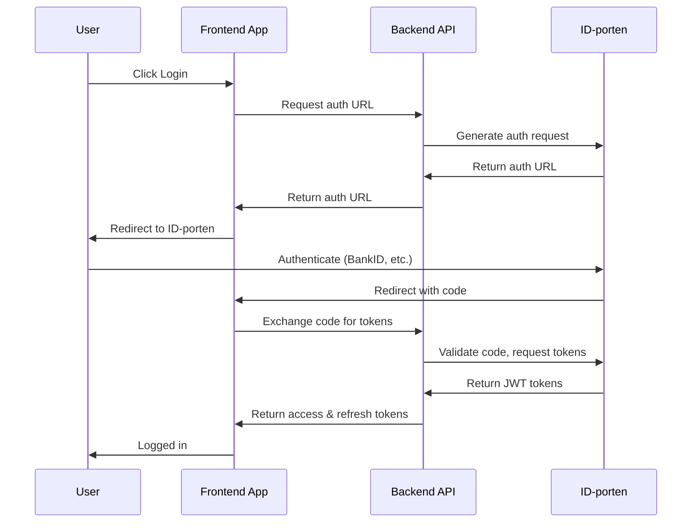

# Security Architecture

This document outlines the comprehensive security architecture of the Xala Diglist Platform, including authentication, authorization, data protection, and compliance measures.

## Security Overview

Our security architecture follows the principle of "security by design" with multiple layers of protection:
- **Zero Trust** - Verify everything, trust nothing
- **Defense in Depth** - Multiple security layers
- **Principle of Least Privilege** - Minimal necessary permissions
- **Audit Everything** - Complete traceability

## Authentication Architecture

### ID-porten Integration
We integrate with Norway's national ID-porten for authentication:



### JWT Token Management
```typescript
// Token structure
interface JWTPayload {
  sub: string;          // User ID
  iss: 'diglist.no';    // Issuer
  aud: 'diglist-api';   // Audience
  exp: number;          // Expiration
  iat: number;          // Issued at
  jti: string;          // JWT ID
  roles: string[];      // User roles
  orgId: string;        // Organization ID
  permissions: string[]; // Permissions
}

// Token refresh flow
export class TokenService {
  async refreshAccessToken(refreshToken: string): Promise<TokenPair> {
    // Validate refresh token
    const payload = await this.validateToken(refreshToken);
    
    // Check if token is revoked
    if (await this.isTokenRevoked(payload.jti)) {
      throw new UnauthorizedError('Token revoked');
    }
    
    // Generate new token pair
    return this.generateTokenPair(payload.sub);
  }
}
```

### Session Management
```typescript
// Secure session configuration
export const sessionConfig = {
  name: 'diglist-session',
  secret: process.env.SESSION_SECRET,
  resave: false,
  saveUninitialized: false,
  cookie: {
    secure: process.env.NODE_ENV === 'production',
    httpOnly: true,
    maxAge: 24 * 60 * 60 * 1000, // 24 hours
    sameSite: 'strict',
  },
  rolling: true, // Reset expiration on activity
};
```

## Authorization Architecture

### RBAC (Role-Based Access Control)
```typescript
// Role definitions
export enum Role {
  ADMIN = 'admin',
  ORG_ADMIN = 'org_admin',
  LISTING_MANAGER = 'listing_manager',
  BOOKING_MANAGER = 'booking_manager',
  USER = 'user',
}

// Permission matrix
const rolePermissions = {
  [Role.ADMIN]: [
    'user:*',
    'organization:*',
    'listing:*',
    'booking:*',
    'audit:*',
  ],
  [Role.ORG_ADMIN]: [
    'user:read',
    'user:update',
    'organization:read',
    'organization:update',
    'listing:*',
    'booking:*',
  ],
  [Role.LISTING_MANAGER]: [
    'listing:create',
    'listing:read',
    'listing:update',
    'listing:delete',
    'booking:read',
  ],
  [Role.USER]: [
    'listing:read',
    'booking:create',
    'booking:read',
    'booking:update:own',
    'booking:delete:own',
  ],
};
```

### ABAC (Attribute-Based Access Control)
```typescript
// Fine-grained permissions
export class PermissionService {
  async canAccessResource(
    user: User,
    resource: string,
    action: string,
    context?: any
  ): Promise<boolean> {
    // Check role-based permissions
    const hasRolePermission = this.checkRolePermission(user.roles, resource, action);
    
    // Check attribute-based permissions
    const hasAttributePermission = await this.checkAttributes(
      user,
      resource,
      action,
      context
    );
    
    return hasRolePermission && hasAttributePermission;
  }
  
  private async checkAttributes(
    user: User,
    resource: string,
    action: string,
    context: any
  ): Promise<boolean> {
    switch (resource) {
      case 'listing':
        return this.canAccessListing(user, action, context);
      case 'booking':
        return this.canAccessBooking(user, action, context);
      default:
        return false;
    }
  }
  
  private async canAccessListing(
    user: User,
    action: string,
    context: { listingId: string }
  ): Promise<boolean> {
    const listing = await this.listingRepo.findById(context.listingId);
    
    // User can edit their organization's listings
    if (action === 'update' && user.organizationId === listing.organizationId) {
      return user.permissions.includes('listing:update');
    }
    
    // User can delete only if they're the creator
    if (action === 'delete' && user.id === listing.createdBy) {
      return user.permissions.includes('listing:delete');
    }
    
    return false;
  }
}
```

### Permission Decorators
```typescript
// Method-level security
@RequirePermissions(['listing:create'])
@RequireRole(Role.LISTING_MANAGER)
async createListing(data: CreateListingDTO): Promise<ListingDTO> {
  // Implementation
}

// Parameter-level security
async updateListing(
  @Param('id') id: string,
  @Body() data: UpdateListingDTO,
  @CurrentUser() user: User
): Promise<ListingDTO> {
  // Check if user can update this specific listing
  const canUpdate = await this.permissionService.canAccessResource(
    user,
    'listing',
    'update',
    { listingId: id }
  );
  
  if (!canUpdate) {
    throw new ForbiddenError('Cannot update this listing');
  }
  
  // Implementation
}
```

## Data Protection

### Encryption at Rest
```typescript
// Database encryption configuration
export const dbConfig = {
  encryption: {
    // Transparent Data Encryption
    transparent: true,
    
    // Column-level encryption for sensitive data
    columns: {
      users: {
        ssn: 'aes-256-gcm',
        email: 'aes-256-gcm',
        phone: 'aes-256-gcm',
      },
      bookings: {
        specialRequests: 'aes-256-gcm',
      },
    },
  },
};

// Encryption service
export class EncryptionService {
  private readonly key = process.env.ENCRYPTION_KEY;
  
  async encrypt(data: string): Promise<string> {
    const iv = crypto.randomBytes(16);
    const cipher = crypto.createCipher('aes-256-gcm', this.key, iv);
    
    let encrypted = cipher.update(data, 'utf8', 'hex');
    encrypted += cipher.final('hex');
    
    const authTag = cipher.getAuthTag();
    
    return `${iv.toString('hex')}:${authTag.toString('hex')}:${encrypted}`;
  }
  
  async decrypt(encryptedData: string): Promise<string> {
    const [ivHex, authTagHex, encrypted] = encryptedData.split(':');
    const iv = Buffer.from(ivHex, 'hex');
    const authTag = Buffer.from(authTagHex, 'hex');
    
    const decipher = crypto.createDecipher('aes-256-gcm', this.key, iv);
    decipher.setAuthTag(authTag);
    
    let decrypted = decipher.update(encrypted, 'hex', 'utf8');
    decrypted += decipher.final('utf8');
    
    return decrypted;
  }
}
```

### Encryption in Transit
```typescript
// HTTPS configuration
export const httpsConfig = {
  protocols: ['TLSv1.2', 'TLSv1.3'],
  ciphers: [
    'ECDHE-ECDSA-AES256-GCM-SHA384',
    'ECDHE-RSA-AES256-GCM-SHA384',
    'ECDHE-ECDSA-CHACHA20-POLY1305',
    'ECDHE-RSA-CHACHA20-POLY1305',
  ],
  honorCipherOrder: true,
  
  // HSTS
  hsts: {
    maxAge: 31536000, // 1 year
    includeSubDomains: true,
    preload: true,
  },
};

// API security headers
export const securityHeaders = {
  'Content-Security-Policy': "default-src 'self'; script-src 'self' 'unsafe-inline'",
  'X-Frame-Options': 'DENY',
  'X-Content-Type-Options': 'nosniff',
  'Referrer-Policy': 'strict-origin-when-cross-origin',
  'Permissions-Policy': 'camera=(), microphone=(), geolocation=()',
};
```

### Data Masking
```typescript
// PII masking for logs
export class DataMasker {
  private sensitiveFields = ['ssn', 'email', 'phone', 'creditCard'];
  
  maskObject(obj: any): any {
    const masked = { ...obj };
    
    for (const field of this.sensitiveFields) {
      if (masked[field]) {
        masked[field] = this.maskValue(masked[field]);
      }
    }
    
    return masked;
  }
  
  private maskValue(value: string): string {
    if (value.length <= 4) return '****';
    return value.slice(0, 2) + '*'.repeat(value.length - 4) + value.slice(-2);
  }
}
```

## Audit & Compliance

### Audit Trail
```typescript
// Audit entity
@Entity('audit_logs')
export class AuditLog {
  @PrimaryGeneratedColumn('uuid')
  id: string;
  
  @Column()
  userId: string;
  
  @Column()
  action: string;
  
  @Column('jsonb')
  resource: {
    type: string;
    id: string;
    changes?: any;
  };
  
  @Column('jsonb')
  metadata: {
    ip: string;
    userAgent: string;
    timestamp: Date;
    sessionId: string;
  };
  
  @Column()
  tenantId: string;
  
  @CreateDateColumn()
  createdAt: Date;
}

// Audit decorator
export function Audit(action: string) {
  return function (target: any, propertyKey: string, descriptor: PropertyDescriptor) {
    const originalMethod = descriptor.value;
    
    descriptor.value = async function (...args: any[]) {
      const result = await originalMethod.apply(this, args);
      
      // Log the action
      await this.auditService.log({
        userId: this.currentUser.id,
        action,
        resource: {
          type: target.constructor.name,
          id: args[0]?.id,
        },
        metadata: {
          ip: this.request.ip,
          userAgent: this.request.headers['user-agent'],
          timestamp: new Date(),
        },
        tenantId: this.currentUser.tenantId,
      });
      
      return result;
    };
  };
}
```

### GDPR Compliance
```typescript
// GDPR service
export class GDPRService {
  // Right to be forgotten
  async deleteUserData(userId: string): Promise<void> {
    // Anonymize instead of delete for audit purposes
    await this.userRepository.anonymize(userId);
    
    // Delete or anonymize related data
    await this.bookingRepository.anonymizeByUser(userId);
    await this.auditRepository.anonymizeByUser(userId);
    
    // Log the deletion request
    await this.auditService.log({
      userId,
      action: 'GDPR_DELETE_REQUEST',
      resource: { type: 'user', id: userId },
    });
  }
  
  // Data export
  async exportUserData(userId: string): Promise<UserDataExport> {
    const user = await this.userRepository.findById(userId);
    const bookings = await this.bookingRepository.findByUser(userId);
    const auditLogs = await this.auditRepository.findByUser(userId);
    
    return {
      personalData: this.sanitizeUserData(user),
      bookings,
      activity: auditLogs,
      exportDate: new Date(),
    };
  }
  
  // Consent management
  async updateConsent(userId: string, consents: ConsentData): Promise<void> {
    await this.consentRepository.upsert(userId, {
      ...consents,
      ipAddress: this.request.ip,
      timestamp: new Date(),
    });
  }
}
```

## API Security

### Rate Limiting
```typescript
// Rate limiting configuration
export const rateLimitConfig = {
  // General API limits
  global: {
    windowMs: 15 * 60 * 1000, // 15 minutes
    max: 1000, // 1000 requests per window
  },
  
  // Authentication endpoints
  auth: {
    windowMs: 15 * 60 * 1000,
    max: 5, // 5 login attempts
    skipSuccessfulRequests: true,
  },
  
  // Heavy operations
  heavy: {
    windowMs: 60 * 1000, // 1 minute
    max: 10, // 10 heavy operations
  },
};

// Implementation
@UseGuards(RateLimitGuard)
@Controller('api/v1/auth')
export class AuthController {
  @RateLimit(rateLimitConfig.auth)
  @Post('login')
  async login(): Promise<LoginResponse> {
    // Implementation
  }
}
```

### Input Validation
```typescript
// DTO with validation
export class CreateListingDTO {
  @IsString()
  @Length(1, 100)
  title: string;
  
  @IsString()
  @Length(1, 1000)
  description: string;
  
  @IsEmail()
  @Optional()
  contactEmail?: string;
  
  @IsArray()
  @ArrayMinSize(1)
  @IsString({ each: true })
  amenities: string[];
  
  @IsObject()
  @ValidateNested()
  location: LocationDTO;
  
  @IsEnum(ListingStatus)
  status: ListingStatus;
}

// Sanitization
export class SanitizationPipe implements PipeTransform {
  transform(value: any) {
    if (typeof value === 'string') {
      // Sanitize HTML
      value = DOMPurify.sanitize(value);
      
      // Remove potential XSS
      value = value.replace(/<script\b[^<]*(?:(?!<\/script>)<[^<]*)*<\/script>/gi, '');
    }
    
    return value;
  }
}
```

### API Key Management
```typescript
// API key service
export class APIKeyService {
  async generateKey(orgId: string, permissions: string[]): Promise<APIKey> {
    const key = this.generateSecureKey();
    const hashed = await this.hashKey(key);
    
    const apiKey = await this.apiKeyRepository.create({
      id: generateUUID(),
      hashedKey: hashed,
      organizationId: orgId,
      permissions,
      createdAt: new Date(),
      lastUsed: null,
    });
    
    // Return only the raw key once
    return { ...apiKey, key };
  }
  
  async validateKey(key: string): Promise<APIKey | null> {
    const hashed = await this.hashKey(key);
    return this.apiKeyRepository.findByHashedKey(hashed);
  }
  
  private generateSecureKey(): string {
    return randomBytes(32).toString('hex');
  }
  
  private async hashKey(key: string): Promise<string> {
    return bcrypt.hash(key, 12);
  }
}
```

## Infrastructure Security

### Network Security
```yaml
# Docker network configuration
networks:
  frontend:
    driver: bridge
    internal: false
  backend:
    driver: bridge
    internal: true
  database:
    driver: bridge
    internal: true

# Service configuration
services:
  api:
    networks:
      - frontend
      - backend
    ports:
      - "3002:3002"
    environment:
      - TRUST_PROXY=nginx
  
  database:
    networks:
      - database
    ports: []  # No external access
```

### Container Security
```dockerfile
# Multi-stage build for minimal attack surface
FROM node:18-alpine AS builder
WORKDIR /app
COPY package*.json ./
RUN npm ci --only=production

FROM node:18-alpine AS runtime
RUN addgroup -g 1001 -S nodejs
RUN adduser -S diglist -u 1001
WORKDIR /app
COPY --from=builder /app/node_modules ./node_modules
COPY . .
USER diglist
EXPOSE 3002
CMD ["node", "dist/main.js"]
```

### Secrets Management
```typescript
// Vault integration
export class SecretsService {
  private vault: Vault;
  
  async getSecret(key: string): Promise<string> {
    try {
      const secret = await this.vault.read(`secret/data/${key}`);
      return secret.data.data.value;
    } catch (error) {
      throw new Error(`Failed to retrieve secret: ${key}`);
    }
  }
  
  async rotateSecret(key: string): Promise<void> {
    const newValue = this.generateSecret();
    await this.vault.write(`secret/data/${key}`, {
      value: newValue,
      rotatedAt: new Date(),
    });
    
    // Update dependent services
    await this.notifyServices(key, newValue);
  }
}
```

## Monitoring & Threat Detection

### Security Monitoring
```typescript
// Security event monitoring
export class SecurityMonitor {
  async detectAnomalies(event: SecurityEvent): Promise<void> {
    // Detect brute force attacks
    if (await this.isBruteForceAttack(event)) {
      await this.blockIP(event.ip);
      await this.notifySecurityTeam('Brute force attack detected', event);
    }
    
    // Detect unusual access patterns
    if (await this.isUnusualPattern(event)) {
      await this.flagForReview(event);
    }
    
    // Detect data exfiltration
    if (await this.isDataExfiltration(event)) {
      await this.triggerAlert('Potential data exfiltration', event);
    }
  }
  
  private async isBruteForceAttack(event: SecurityEvent): Promise<boolean> {
    const recentFailures = await this.getRecentFailures(event.ip, 15 * 60 * 1000);
    return recentFailures > 10;
  }
}
```

### Security Headers
```typescript
// Security middleware
export function securityMiddleware(req: Request, res: Response, next: NextFunction) {
  // Set security headers
  res.setHeader('X-Content-Type-Options', 'nosniff');
  res.setHeader('X-Frame-Options', 'DENY');
  res.setHeader('X-XSS-Protection', '1; mode=block');
  res.setHeader('Strict-Transport-Security', 'max-age=31536000; includeSubDomains');
  res.setHeader('Content-Security-Policy', CSP_POLICY);
  
  // Remove server header
  res.removeHeader('Server');
  
  next();
}
```

## Compliance & Certifications

### ISO 27001 Controls
```typescript
// Control implementation tracking
export class ComplianceService {
  controls = {
    'A.9.1.1': { // Access control policy
      implemented: true,
      evidence: '/docs/access-control-policy.pdf',
      lastReviewed: '2024-01-15',
    },
    'A.12.2.1': { // Malware protection
      implemented: true,
      evidence: '/docs/malware-protection.pdf',
      lastReviewed: '2024-01-15',
    },
    // ... more controls
  };
  
  async generateComplianceReport(): Promise<ComplianceReport> {
    return {
      standard: 'ISO 27001:2022',
      controls: this.controls,
      compliancePercentage: this.calculateCompliance(),
      gaps: this.identifyGaps(),
      lastAudit: '2024-01-15',
    };
  }
}
```

### Privacy by Design
```typescript
// Privacy impact assessment
export class PrivacyAssessment {
  async assessFeature(feature: Feature): Promise<PrivacyReport> {
    const risks = await this.identifyPrivacyRisks(feature);
    const mitigations = await this.recommendMitigations(risks);
    
    return {
      feature: feature.name,
      dataCollected: feature.dataPoints,
      risks,
      mitigations,
      approvalRequired: risks.some(r => r.severity === 'high'),
    };
  }
}
```

## Security Best Practices

### 1. Development Practices
- **Security code reviews** for all changes
- **Static analysis** with security tools
- **Dependency scanning** for vulnerabilities
- **Secret scanning** in repositories

### 2. Deployment Practices
- **Immutable infrastructure**
- **Blue-green deployments**
- **Automated security testing**
- **Rollback procedures**

### 3. Operational Practices
- **Regular security audits**
- **Penetration testing**
- **Incident response drills**
- **Security training**

## Incident Response

### Response Plan
```typescript
// Incident response workflow
export class IncidentResponse {
  async handleIncident(incident: SecurityIncident): Promise<void> {
    // 1. Detection
    await this.detect(incident);
    
    // 2. Containment
    await this.contain(incident);
    
    // 3. Investigation
    const investigation = await this.investigate(incident);
    
    // 4. Recovery
    await this.recover(incident);
    
    // 5. Post-mortem
    await this.postMortem(incident, investigation);
  }
  
  private async contain(incident: SecurityIncident): Promise<void> {
    switch (incident.type) {
      case 'DATA_BREACH':
        await this.isolateSystems(incident.affectedSystems);
        await this.revokeSessions(incident.affectedUsers);
        break;
      case 'DDOS_ATTACK':
        await this.activateDDoSMitigation();
        break;
      case 'UNAUTHORIZED_ACCESS':
        await this.blockIP(incident.sourceIP);
        await this.resetPasswords(incident.affectedUsers);
        break;
    }
  }
}
```

## Related Documentation

- [Architecture Overview](./01-overview.md)
- [Application Architecture](./03-applications.md)
- [GDPR Implementation](../guides/06-gdpr.md)
- [Testing Strategy](../guides/02-testing.md)
