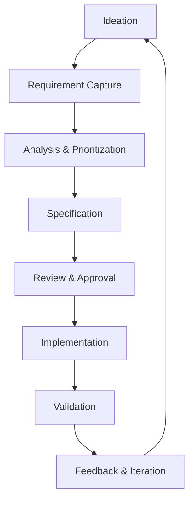

# Product Requirements Process (PRP)

## Overview

**Document Name:** Xala Diglist Platform - Product Requirements Process  
**Version:** 1.0.0  
**Date:** January 15, 2026  
**Owner:** Product Team  

### 1. Purpose

This document defines the standardized process for managing product requirements throughout the Xala Diglist Platform lifecycle. It ensures consistency, traceability, and alignment with business objectives.

### 2. Process Overview

The Product Requirements Process follows a structured approach from ideation to implementation and feedback:



### 3. Roles and Responsibilities

#### 3.1 Product Owner
- **Primary responsibility** for requirement definition
- Facilitates requirement gathering sessions
- Maintains the product backlog
- Ensures requirements align with business goals
- Has final approval authority on requirements

#### 3.2 Technical Lead
- Provides technical feasibility assessment
- Defines technical requirements and constraints
- Identifies implementation dependencies
- Estimates development effort
- Ensures architectural alignment

#### 3.3 Design Lead
- Defines user experience requirements
- Creates wireframes and prototypes
- Ensures accessibility compliance
- Validates user interaction flows
- Maintains design system consistency

#### 3.4 Compliance Officer
- Validates regulatory compliance
- Identifies legal and privacy requirements
- Ensures audit trail completeness
- Reviews data handling procedures
- Documents compliance evidence

#### 3.5 Stakeholder Representatives
- Provide domain-specific requirements
- Validate business process alignment
- Participate in review sessions
- Provide feedback on implementations
- Champion adoption within their areas

### 4. Requirement Types

#### 4.1 Functional Requirements
Define what the system must do:
- User stories and use cases
- Business rules and constraints
- Integration requirements
- Data management needs
- Workflow specifications

#### 4.2 Non-Functional Requirements
Define system qualities:
- Performance criteria
- Security requirements
- Accessibility standards
- Scalability needs
- Reliability metrics

#### 4.3 Compliance Requirements
Define regulatory obligations:
- SSA-L clause mappings
- GDPR implementation needs
- Audit requirements
- Data retention policies
- Reporting obligations

#### 4.4 Technical Requirements
Define implementation constraints:
- Technology stack requirements
- Integration specifications
- Data model requirements
- API definitions
- Infrastructure needs

### 5. Requirement Lifecycle

#### 5.1 Discovery Phase

##### Activities
1. **Stakeholder Interviews**
   - Schedule structured interviews
   - Document pain points and needs
   - Identify success criteria
   - Capture existing workflows

2. **Market Research**
   - Analyze competitor solutions
   - Identify industry best practices
   - Research regulatory changes
   - Gather user feedback

3. **Workshop Sessions**
   - Conduct collaborative workshops
   - Use design thinking techniques
   - Create user journey maps
   - Prioritize pain points

##### Deliverables
- Stakeholder requirement summaries
- User persona definitions
- Pain point analysis
- Initial requirement backlog

#### 5.2 Analysis Phase

##### Activities
1. **Requirement Classification**
   - Categorize by type and priority
   - Identify dependencies
   - Map to business objectives
   - Assess feasibility

2. **Impact Assessment**
   - Evaluate business impact
   - Assess technical complexity
   - Identify risk factors
   - Estimate ROI

3. **Gap Analysis**
   - Compare with current state
   - Identify missing capabilities
   - Define migration needs
   - Plan integration points

##### Deliverables
- Requirement classification matrix
- Impact assessment reports
- Gap analysis documentation
- Prioritized backlog

#### 5.3 Specification Phase

##### Activities
1. **Detailed Requirements**
   - Write user stories
   - Define acceptance criteria
   - Create process flows
   - Specify data requirements

2. **Technical Specifications**
   - Define API contracts
   - Create data models
   - Specify integrations
   - Document constraints

3. **Compliance Mapping**
   - Map to SSA-L clauses
   - Document GDPR compliance
   - Define audit requirements
   - Create compliance matrix

##### Deliverables
- Detailed requirement specifications
- Technical design documents
- Compliance mapping matrix
- Acceptance criteria definitions

#### 5.4 Review and Approval

##### Review Process
1. **Stakeholder Review**
   - Circulate for comments
   - Address feedback
   - Update documentation
   - Track changes

2. **Formal Approval**
   - Schedule review meeting
   - Present requirements
   - Record decisions
   - Obtain sign-off

3. **Change Control**
   - Document change requests
   - Assess impact
   - Update requirements
   - Communicate changes

##### Approval Criteria
- All stakeholders have reviewed
- Technical feasibility confirmed
- Compliance validated
- Business value demonstrated
- Implementation plan defined

#### 5.5 Implementation Phase

##### Activities
1. **Development Planning**
   - Create sprint plans
   - Define tasks and stories
   - Allocate resources
   - Set milestones

2. **Development**
   - Implement features
   - Write tests
   - Document code
   - Conduct reviews

3. **Progress Tracking**
   - Monitor milestones
   - Track metrics
   - Report status
   - Manage risks

##### Deliverables
- Sprint plans and backlogs
- Working software increments
- Test documentation
- Progress reports

#### 5.6 Validation Phase

##### Activities
1. **Testing**
   - Unit testing
   - Integration testing
   - User acceptance testing
   - Compliance validation

2. **Demo and Feedback**
   - Conduct demos
   - Collect feedback
   - Document issues
   - Plan improvements

3. **Sign-off**
   - Obtain acceptance
   - Document lessons learned
   - Update processes
   - Celebrate success

##### Deliverables
- Test reports
- User feedback summaries
- Acceptance sign-off
- Lessons learned documentation

### 6. Documentation Standards

#### 6.1 Requirement Format
Each requirement must include:
- Unique identifier (REQ-XXX)
- Clear, concise description
- Rationale/business value
- Acceptance criteria
- Priority level
- Dependencies
- Stakeholder owner

#### 6.2 User Story Format
```gherkin
As a [user type]
I want [functionality]
So that [benefit]

Acceptance Criteria:
- Given [context]
- When [action]
- Then [outcome]
```

#### 6.3 Traceability Matrix
Maintain traceability between:
- Business objectives
- Requirements
- Design elements
- Code components
- Test cases

### 7. Tools and Templates

#### 7.1 Required Tools
- **Jira/Linear** - Requirement tracking
- **Confluence** - Documentation
- **Figma** - Design and prototypes
- **GitHub** - Code and documentation
- **Slack** - Communication

#### 7.2 Templates
- Requirement capture form
- User story template
- Technical specification template
- Compliance mapping template
- Review checklist

### 8. Quality Gates

#### 8.1 Definition of Ready
- Requirement clearly defined
- Acceptance criteria specified
- Technical feasibility assessed
- Dependencies identified
- Priority assigned

#### 8.2 Definition of Done
- Code implemented and tested
- Documentation updated
- Compliance validated
- Stakeholder acceptance
- Lessons learned documented

### 9. Change Management

#### 9.1 Change Request Process
1. Submit change request
2. Assess impact and priority
3. Review with stakeholders
4. Update requirements
5. Communicate changes
6. Update plans

#### 9.2 Emergency Changes
- Immediate risk assessment
- Fast-track approval
- Implementation with oversight
- Post-implementation review
- Process improvement

### 10. Metrics and KPIs

#### 10.1 Process Metrics
- Requirement accuracy rate
- Time from ideation to implementation
- Change request frequency
- Stakeholder satisfaction
- Compliance adherence

#### 10.2 Quality Metrics
- Defect density
- Test coverage
- User acceptance rate
- Performance against SLAs
- Security incident count

### 11. Continuous Improvement

#### 11.1 Retrospectives
- Conduct regular retrospectives
- Identify process improvements
- Update templates and tools
- Share best practices
- Train team members

#### 11.2 Process Audits
- Quarterly process reviews
- Compliance audits
- Stakeholder feedback sessions
- Performance analysis
- Improvement planning

### 12. Governance

#### 12.1 Requirement Board
- Weekly requirement reviews
- Priority adjustments
- Resource allocation
- Risk assessment
- Decision making

#### 12.2 Escalation Process
1. Team level resolution
2. Product Owner escalation
3. Steering committee review
4. Executive decision
5. Documentation and communication

### 13. Training and Onboarding

#### 13.1 Team Training
- Process orientation
- Tool training
- Best practice workshops
- Compliance training
- Cross-functional learning

#### 13.2 Stakeholder Onboarding
- Process overview
- Role responsibilities
- Tool access and training
- Communication protocols
- Success metrics

### 14. Appendices

#### 14.1 Templates
- Requirement capture form
- User story template
- Technical specification template
- Compliance mapping template
- Review checklist

#### 14.2 Process Flows
- Requirement lifecycle flow
- Change request flow
- Approval process flow
- Escalation process flow

#### 14.3 Glossary
- Key terms and definitions
- Acronyms and abbreviations
- Process-specific terminology
- Reference materials

---

**Document History**

| Version | Date | Changes | Author |
|---------|------|---------|--------|
| 1.0.0 | 2026-01-15 | Initial PRP creation | Product Team |
