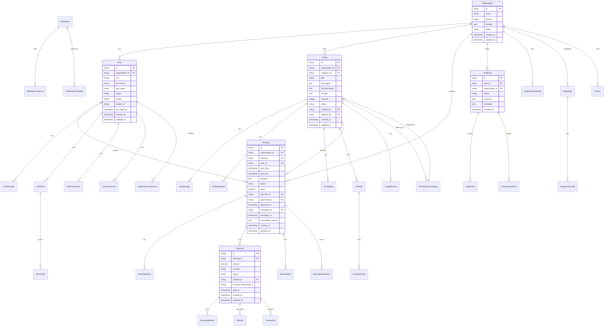

# Entity Relationship Diagram (ERD) & Database Schema

## Overview

This document provides the complete entity relationship diagram and database schema for the Xala Diglist Platform, designed to support multi-tenant municipal booking with full audit capabilities.

## ERD Diagram



## Detailed Schema Structure

### 1. Core Entities

#### Organization
```sql
CREATE TABLE organizations (
    id TEXT PRIMARY KEY DEFAULT generate_cuid(),
    name TEXT NOT NULL,
    domain TEXT UNIQUE NOT NULL,
    settings JSONB DEFAULT '{}',
    status TEXT DEFAULT 'active',
    created_at TIMESTAMP DEFAULT CURRENT_TIMESTAMP,
    updated_at TIMESTAMP DEFAULT CURRENT_TIMESTAMP
);

CREATE INDEX idx_organizations_domain ON organizations(domain);
CREATE INDEX idx_organizations_status ON organizations(status);
```

#### User
```sql
CREATE TABLE users (
    id TEXT PRIMARY KEY DEFAULT generate_cuid(),
    organization_id TEXT NOT NULL REFERENCES organizations(id) ON DELETE CASCADE,
    ssn TEXT UNIQUE NOT NULL,
    first_name TEXT NOT NULL,
    last_name TEXT NOT NULL,
    email TEXT UNIQUE NOT NULL,
    phone TEXT,
    avatar_url TEXT,
    last_login_at TIMESTAMP,
    created_at TIMESTAMP DEFAULT CURRENT_TIMESTAMP,
    updated_at TIMESTAMP DEFAULT CURRENT_TIMESTAMP
);

CREATE INDEX idx_users_organization_id ON users(organization_id);
CREATE INDEX idx_users_email ON users(email);
CREATE INDEX idx_users_ssn ON users(ssn);
```

### 2. Listing Management

#### Listing
```sql
CREATE TABLE listings (
    id TEXT PRIMARY KEY DEFAULT generate_cuid(),
    organization_id TEXT NOT NULL REFERENCES organizations(id) ON DELETE CASCADE,
    category_id TEXT NOT NULL REFERENCES listing_categories(id),
    title TEXT NOT NULL,
    description TEXT NOT NULL,
    full_description TEXT,
    location JSONB NOT NULL,
    capacity INTEGER NOT NULL,
    status TEXT DEFAULT 'available',
    created_by TEXT NOT NULL REFERENCES users(id),
    updated_by TEXT REFERENCES users(id),
    created_at TIMESTAMP DEFAULT CURRENT_TIMESTAMP,
    updated_at TIMESTAMP DEFAULT CURRENT_TIMESTAMP,
    
    CONSTRAINT listings_capacity_positive CHECK (capacity > 0)
);

CREATE INDEX idx_listings_organization_id ON listings(organization_id);
CREATE INDEX idx_listings_category_id ON listings(category_id);
CREATE INDEX idx_listings_status ON listings(status);
CREATE INDEX idx_listings_location ON listings USING GIN(location);
```

#### Listing Images
```sql
CREATE TABLE listing_images (
    id TEXT PRIMARY KEY DEFAULT generate_cuid(),
    listing_id TEXT NOT NULL REFERENCES listings(id) ON DELETE CASCADE,
    url TEXT NOT NULL,
    alt_text TEXT,
    sort_order INTEGER DEFAULT 0,
    created_at TIMESTAMP DEFAULT CURRENT_TIMESTAMP
);

CREATE INDEX idx_listing_images_listing_id ON listing_images(listing_id);
CREATE INDEX idx_listing_images_sort_order ON listing_images(sort_order);
```

#### Availability Rules
```sql
CREATE TABLE availability_rules (
    id TEXT PRIMARY KEY DEFAULT generate_cuid(),
    listing_id TEXT NOT NULL REFERENCES listings(id) ON DELETE CASCADE,
    day_of_week INTEGER NOT NULL, -- 0-6 (Sunday-Saturday)
    start_time TIME NOT NULL,
    end_time TIME NOT NULL,
    is_available BOOLEAN DEFAULT true,
    created_at TIMESTAMP DEFAULT CURRENT_TIMESTAMP,
    updated_at TIMESTAMP DEFAULT CURRENT_TIMESTAMP,
    
    CONSTRAINT availability_rules_time CHECK (end_time > start_time),
    CONSTRAINT availability_rules_dow CHECK (day_of_week BETWEEN 0 AND 6)
);

CREATE INDEX idx_availability_rules_listing_id ON availability_rules(listing_id);
```

### 3. Booking System

#### Booking
```sql
CREATE TABLE bookings (
    id TEXT PRIMARY KEY DEFAULT generate_cuid(),
    organization_id TEXT NOT NULL REFERENCES organizations(id) ON DELETE CASCADE,
    listing_id TEXT NOT NULL REFERENCES listings(id) ON DELETE CASCADE,
    user_id TEXT NOT NULL REFERENCES users(id) ON DELETE CASCADE,
    start_time TIMESTAMP NOT NULL,
    end_time TIMESTAMP NOT NULL,
    purpose TEXT,
    status TEXT DEFAULT 'pending',
    price DECIMAL(10,2),
    payment_id TEXT REFERENCES payments(id),
    approved_by TEXT REFERENCES users(id),
    approved_at TIMESTAMP,
    cancelled_by TEXT REFERENCES users(id),
    cancelled_at TIMESTAMP,
    cancellation_reason TEXT,
    created_at TIMESTAMP DEFAULT CURRENT_TIMESTAMP,
    updated_at TIMESTAMP DEFAULT CURRENT_TIMESTAMP,
    
    CONSTRAINT bookings_time CHECK (end_time > start_time)
);

CREATE INDEX idx_bookings_organization_id ON bookings(organization_id);
CREATE INDEX idx_bookings_listing_id ON bookings(listing_id);
CREATE INDEX idx_bookings_user_id ON bookings(user_id);
CREATE INDEX idx_bookings_status ON bookings(status);
CREATE INDEX idx_bookings_time_range ON bookings(start_time, end_time);
```

#### Payment
```sql
CREATE TABLE payments (
    id TEXT PRIMARY KEY DEFAULT generate_cuid(),
    booking_id TEXT NOT NULL REFERENCES bookings(id) ON DELETE CASCADE,
    amount DECIMAL(10,2) NOT NULL,
    currency TEXT DEFAULT 'NOK',
    status TEXT DEFAULT 'pending',
    method_id TEXT REFERENCES payment_methods(id),
    provider_transaction_id TEXT,
    paid_at TIMESTAMP,
    created_at TIMESTAMP DEFAULT CURRENT_TIMESTAMP,
    updated_at TIMESTAMP DEFAULT CURRENT_TIMESTAMP,
    
    CONSTRAINT payments_amount_positive CHECK (amount >= 0)
);

CREATE INDEX idx_payments_booking_id ON payments(booking_id);
CREATE INDEX idx_payments_status ON payments(status);
```

### 4. User Management

#### User Roles
```sql
CREATE TABLE user_roles (
    id TEXT PRIMARY KEY DEFAULT generate_cuid(),
    user_id TEXT NOT NULL REFERENCES users(id) ON DELETE CASCADE,
    role TEXT NOT NULL,
    granted_by TEXT REFERENCES users(id),
    granted_at TIMESTAMP DEFAULT CURRENT_TIMESTAMP,
    expires_at TIMESTAMP,
    
    UNIQUE(user_id, role)
);

CREATE INDEX idx_user_roles_user_id ON user_roles(user_id);
CREATE INDEX idx_user_roles_role ON user_roles(role);
```

#### User Permissions
```sql
CREATE TABLE user_permissions (
    id TEXT PRIMARY KEY DEFAULT generate_cuid(),
    user_id TEXT NOT NULL REFERENCES users(id) ON DELETE CASCADE,
    resource TEXT NOT NULL,
    action TEXT NOT NULL,
    conditions JSONB,
    granted_by TEXT REFERENCES users(id),
    granted_at TIMESTAMP DEFAULT CURRENT_TIMESTAMP,
    expires_at TIMESTAMP,
    
    UNIQUE(user_id, resource, action)
);

CREATE INDEX idx_user_permissions_user_id ON user_permissions(user_id);
CREATE INDEX idx_user_permissions_resource ON user_permissions(resource);
```

### 5. Audit & Compliance

#### Audit Log
```sql
CREATE TABLE audit_logs (
    id TEXT PRIMARY KEY DEFAULT generate_cuid(),
    user_id TEXT REFERENCES users(id),
    organization_id TEXT NOT NULL REFERENCES organizations(id) ON DELETE CASCADE,
    action TEXT NOT NULL,
    resource JSONB NOT NULL,
    metadata JSONB DEFAULT '{}',
    created_at TIMESTAMP DEFAULT CURRENT_TIMESTAMP
);

CREATE INDEX idx_audit_logs_user_id ON audit_logs(user_id);
CREATE INDEX idx_audit_logs_organization_id ON audit_logs(organization_id);
CREATE INDEX idx_audit_logs_action ON audit_logs(action);
CREATE INDEX idx_audit_logs_created_at ON audit_logs(created_at);
```

### 6. Notifications

#### Notifications
```sql
CREATE TABLE notifications (
    id TEXT PRIMARY KEY DEFAULT generate_cuid(),
    user_id TEXT NOT NULL REFERENCES users(id) ON DELETE CASCADE,
    type TEXT NOT NULL,
    title TEXT NOT NULL,
    content TEXT NOT NULL,
    channels TEXT[] DEFAULT ARRAY['in_app'],
    status TEXT DEFAULT 'pending',
    scheduled_at TIMESTAMP,
    sent_at TIMESTAMP,
    read_at TIMESTAMP,
    created_at TIMESTAMP DEFAULT CURRENT_TIMESTAMP
);

CREATE INDEX idx_notifications_user_id ON notifications(user_id);
CREATE INDEX idx_notifications_status ON notifications(status);
CREATE INDEX idx_notifications_scheduled_at ON notifications(scheduled_at);
```

## Database Constraints and Rules

### 1. Multi-Tenant Isolation
```sql
-- Row Level Security for Organizations
ALTER TABLE organizations ENABLE ROW LEVEL SECURITY;
ALTER TABLE users ENABLE ROW LEVEL SECURITY;
ALTER TABLE listings ENABLE ROW LEVEL SECURITY;
ALTER TABLE bookings ENABLE ROW LEVEL SECURITY;

-- Policy: Users can only access their organization's data
CREATE POLICY organization_isolation ON organizations
    FOR ALL TO authenticated_user
    USING (id = current_setting('app.current_organization_id')::TEXT);

CREATE POLICY user_isolation ON users
    FOR ALL TO authenticated_user
    USING (organization_id = current_setting('app.current_organization_id')::TEXT);
```

### 2. Audit Triggers
```sql
-- Audit trigger for all mutations
CREATE OR REPLACE FUNCTION audit_trigger()
RETURNS TRIGGER AS $$
BEGIN
    INSERT INTO audit_logs (
        user_id,
        organization_id,
        action,
        resource,
        metadata
    ) VALUES (
        current_setting('app.current_user_id')::TEXT,
        current_setting('app.current_organization_id')::TEXT,
        TG_OP,
        json_build_object(
            'table', TG_TABLE_NAME,
            'id', COALESCE(NEW.id, OLD.id),
            'old', row_to_json(OLD),
            'new', row_to_json(NEW)
        ),
        json_build_object(
            'ip', current_setting('app.client_ip'),
            'user_agent', current_setting('app.user_agent')
        )
    );
    RETURN COALESCE(NEW, OLD);
END;
$$ LANGUAGE plpgsql;

-- Apply triggers to all tables
CREATE TRIGGER audit_users AFTER INSERT OR UPDATE OR DELETE ON users
    FOR EACH ROW EXECUTE FUNCTION audit_trigger();

CREATE TRIGGER audit_listings AFTER INSERT OR UPDATE OR DELETE ON listings
    FOR EACH ROW EXECUTE FUNCTION audit_trigger();

CREATE TRIGGER audit_bookings AFTER INSERT OR UPDATE OR DELETE ON bookings
    FOR EACH ROW EXECUTE FUNCTION audit_trigger();
```

### 3. Data Validation
```sql
-- Check constraints for business rules
ALTER TABLE bookings ADD CONSTRAINT no_double_bookings 
    EXCLUDE (listing_id WITH =) 
    WHERE (status NOT IN ('cancelled', 'rejected'));

-- Ensure booking time slots don't overlap
ALTER TABLE bookings ADD CONSTRAINT no_overlapping_bookings
    EXCLUDE (listing_id WITH =)
    WHERE (start_time, end_time) && 
    (SELECT tsrange(start_time, end_time) FROM bookings 
     WHERE listing_id = bookings.listing_id 
     AND status NOT IN ('cancelled', 'rejected'));
```

## Performance Optimizations

### 1. Indexes
```sql
-- Composite indexes for common queries
CREATE INDEX idx_bookings_listing_status_time 
    ON bookings(listing_id, status, start_time);

CREATE INDEX idx_listings_org_status 
    ON listings(organization_id, status);

CREATE INDEX idx_users_org_role 
    ON users(organization_id) 
    INCLUDE (email, first_name, last_name);
```

### 2. Partitioning
```sql
-- Partition audit logs by month
CREATE TABLE audit_logs_y2024m01 PARTITION OF audit_logs
    FOR VALUES FROM ('2024-01-01') TO ('2024-02-01');

-- Partition bookings by year
CREATE TABLE bookings_y2024 PARTITION OF bookings
    FOR VALUES FROM ('2024-01-01') TO ('2025-01-01');
```

### 3. Materialized Views
```sql
-- Organization statistics
CREATE MATERIALIZED VIEW organization_stats AS
SELECT 
    o.id,
    o.name,
    COUNT(DISTINCT u.id) as user_count,
    COUNT(DISTINCT l.id) as listing_count,
    COUNT(DISTINCT b.id) as booking_count,
    COALESCE(SUM(b.price), 0) as total_revenue
FROM organizations o
LEFT JOIN users u ON u.organization_id = o.id
LEFT JOIN listings l ON l.organization_id = o.id
LEFT JOIN bookings b ON b.organization_id = o.id
    AND b.status = 'confirmed'
GROUP BY o.id, o.name;

-- Refresh strategy
CREATE OR REPLACE FUNCTION refresh_org_stats()
RETURNS void AS $$
BEGIN
    REFRESH MATERIALIZED VIEW CONCURRENTLY organization_stats;
END;
$$ LANGUAGE plpgsql;
```

## Data Migration Strategy

### 1. Version Control
```sql
-- Migration tracking
CREATE TABLE schema_migrations (
    version TEXT PRIMARY KEY,
    applied_at TIMESTAMP DEFAULT CURRENT_TIMESTAMP
);

-- Example migration
INSERT INTO schema_migrations (version) VALUES ('001_initial_schema');
```

### 2. Backwards Compatibility
```sql
-- Views for legacy API compatibility
CREATE VIEW v_old_bookings AS
SELECT 
    id as booking_id,
    listing_id as facility_id,
    user_id as customer_id,
    start_time as from_time,
    end_time as to_time
FROM bookings;
```

## Security Considerations

### 1. Encryption
```sql
-- Encrypt sensitive data
CREATE EXTENSION IF NOT EXISTS pgcrypto;

-- Encrypted email storage
ALTER TABLE users ADD COLUMN email_encrypted BYTEA;
UPDATE users SET email_encrypted = pgp_sym_encrypt(email, current_setting('app.encryption_key'));
ALTER TABLE users DROP COLUMN email;
ALTER TABLE users RENAME COLUMN email_encrypted TO email;
```

### 2. Anonymization
```sql
-- GDPR compliance - right to be forgotten
CREATE OR REPLACE FUNCTION anonymize_user(user_id TEXT)
RETURNS void AS $$
BEGIN
    UPDATE users SET
        ssn = 'ANONYMIZED',
        email = 'ANONYMIZED',
        phone = 'ANONYMIZED',
        first_name = 'ANONYMIZED',
        last_name = 'ANONYMIZED'
    WHERE id = user_id;
    
    UPDATE audit_logs SET
        user_id = NULL
    WHERE user_id = user_id;
END;
$$ LANGUAGE plpgsql SECURITY DEFINER;
```

## Monitoring Queries

### 1. Health Checks
```sql
-- Database health
CREATE OR REPLACE FUNCTION db_health()
RETURNS JSON AS $$
DECLARE
    result JSON;
BEGIN
    SELECT json_build_object(
        'status', 'healthy',
        'connections', (SELECT count(*) FROM pg_stat_activity),
        'size', pg_size_pretty(pg_database_size(current_database())),
        'timestamp', CURRENT_TIMESTAMP
    ) INTO result;
    
    RETURN result;
END;
$$ LANGUAGE plpgsql;
```

### 2. Performance Metrics
```sql
-- Slow queries
SELECT 
    query,
    mean_time,
    calls,
    total_time
FROM pg_stat_statements
WHERE mean_time > 100
ORDER BY mean_time DESC
LIMIT 10;
```

---

**Document Version**: 1.0.0  
**Last Updated**: January 15, 2026  
**Database Version**: PostgreSQL 14+
